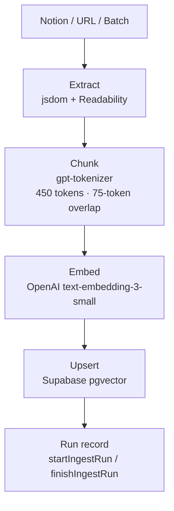

# Portfolio Platform — v0.2.0


> Base: **transitive-bullshit/nextjs-notion-starter-kit** · Author: **Jack H. Park** · Hosting: **Vercel** · CMS: **Notion**

---

## Project 1 — Jack H. Park Studio Website

> Next.js Hybrid (SSG/ISR) & Serverless CMS Integration

Portfolio site rendered from Notion content via a custom `react-notion-x` fork. Extended with custom block renderers, design polish, SEO, dark mode, and mobile UX fixes.

### Notion Rendering — Custom Block Renderers

**Mermaid Diagram Support** (`components/notion-mermaid.tsx`, `components/notion-code.tsx`)
- Detects `language: mermaid` in code blocks and renders live diagrams
- Dynamic CDN loading (`mermaid@10`), dark/light theme detection, SVG sanitization, mindmap auto-scaling (72% for oversized graphs)
- Show/Hide source collapsible; falls back to Prism if render fails

**SidePeek** (`components/SidePeek.tsx`)
- List-type inline database items open in a right-side panel (desktop) or bottom-sheet (mobile)
- 90vh height on mobile — leaves 10vh exposed for tap-to-dismiss
- 40px full-width drag handle (meets WCAG 44px touch target)
- Drag-to-dismiss via framer-motion with spring animation; ESC key to close
- Scroll event propagation into panel so lazy Notion blocks load correctly
- Configurable exclusion list per collection/view (`lib/side-peek.config.ts`)

**Gallery Preview Modal** (inline in `components/NotionPage.tsx`)
- Whitelist-based per-database image preview (`config.galleryPreviewDatabaseIds`)
- Click-to-zoom toggle (1.05× scale), dynamic image source resolution (img, srcset, background-image, cover)
- Keyboard (Escape to close), dark mode support, meta display (title + "Open page" link)
- Non-whitelisted galleries preserve browser default (cmd/ctrl opens new tab)

**YouTube-style Cover Image** (`components/NotionCoverBlurFill.tsx`)
- Two-layer cover: blurred full-width background layer + sharp constrained foreground layer
- Respects Notion cover position (0–1 → CSS `object-position`)

**Custom Property Renderers**
- `propertyLastEditedTimeValue` — "Last updated [date]" in page headers
- `propertyTextValue` — CleanText integration for inline DB cells with bold author support
- `propertyTitleValue` — conditional bold stripping for inline DB titles

**CleanText / NotionImage**
- `CleanText`: safe rich-text renderer that normalizes Notion decorations (bold, italic, code, links) without XSS risk
- `NotionImage`: lazy-loading image with blur placeholder via `loading="lazy"`

---

### Navigation & Layout

**Mobile Hamburger Menu** (`components/NotionPageHeader.tsx`, `NotionPageHeader.module.css`)
- Hamburger button hidden on desktop (≥768px), shown on mobile
- Fixed overlay menu (`z-index: 200`) with dimmed backdrop tap-to-dismiss
- **Architectural fix**: menu rendered *outside* `<header>` — `backdrop-filter` on the header creates a containing block that breaks `position: fixed` children

**Footer** (`components/Footer.tsx`)
- Social links (Twitter, GitHub, LinkedIn, Mastodon, YouTube, Instagram, Newsletter)
- Dark mode toggle, auto-updated copyright year

**NavigationProgress** (`components/NavigationProgress.tsx`)
- Animated progress bar on route changes; 150ms delay prevents flash on fast navigations

---

### SEO & Metadata

**PageHead** (`components/PageHead.tsx`)
- Full OpenGraph (`og:title`, `og:description`, `og:image`, `og:url`, `og:site_name`, `og:type`)
- Twitter Card (`summary_large_image`, `twitter:creator`, `twitter:domain`)
- Canonical URL, Robots (`index,follow`)
- Mobile meta: `viewport-fit=cover` (notch support), `apple-mobile-web-app-capable`
- Theme color with `prefers-color-scheme` media query
- JSON-LD `BlogPosting` structured data for blog posts

**Dynamic OG Images** (`pages/api/social-image.tsx`)
- Edge runtime; generates 1200×630 images via `next/og`
- Composites page cover + dark overlay + title/description/author with Inter font

**RSS Feed** (`pages/feed.tsx`)
- Filters blog posts from root Notion space
- Includes published/last-updated dates, description, social image enclosure, 24h TTL

**Sitemap** (`lib/get-site-map.ts`, `pages/sitemap.xml.tsx`)
- Disk-cached at `.next/cache/notion-sitemap.json` (5 min dev / 60 min prod)
- Lightweight fetch (`fetchCollections: true` only) — avoids 5–10× API call multiplication that exhausts Notion rate limits

---

### Dark Mode

- `DarkModeProvider` lives in `_app` (never unmounts) — syncs both `dark` and `dark-mode` classes on `document.body`
- Inlined no-flash script in `_document.tsx` reads `localStorage('darkMode')` and `prefers-color-scheme` before React hydration
- `ToggleThemeButton` with lazy hydration protection (prevents SSR mismatch)

---

### CSS Architecture — Notion Polish

Four layered stylesheets applied in order:

| File | Role |
|---|---|
| `notion-parity.css` | Recreates Notion.site visual design (layout, typography scale, header blur) |
| `notion-feature.css` | Feature-specific: Mermaid theming, gallery modal, select padding, video scaling |
| `notion-brand.css` | Design accents: gradient link underlines, highlighted text backgrounds, code block borders |
| `notion-legacy.css` | Fallback for legacy polish profile |

Profile switching (`notionPolishProfile: "balanced" | "legacy"`) via `lib/config.ts`.

---

### Performance & ISR

- **ISR revalidate: 60** — pages regenerate every 60s without blocking users
- `fallback: 'blocking'` — server generates unbuilt pages before responding (no loading flash)
- `experimental.scrollRestoration: true` — smooth back-navigation scroll position
- Modern image formats: avif, webp via Next.js image optimization
- Dynamic imports for heavy blocks (Code, Collection, Equation, PDF, Modal)
- `outputFileTracingExcludes` removes canvas native binaries from Lambda bundle

---

### react-notion-x Fork

Custom fork with versioning `7.7.1-jp.N`:

```bash
pnpm deps:use-local    # switch to local fork for development
pnpm deps:release      # publish fork + switch back to remote
pnpm setup-hooks       # install pre-push guard (blocks push in local-link mode)
```

---

### Mobile UX Fixes (2026-06)

Five production bugs resolved with root-cause documentation (`docs/incidents/mobile-ux-and-navigation-fixes-2026-06.md`):

| Bug | Fix |
|---|---|
| Hamburger menu obscured by header `backdrop-filter` | Render mobile menu outside `<header>` |
| Inline DB items not tappable on mobile | `pointer-events: none` on ChatFloatingWidget container; `touch-action: manipulation` on table cells |
| SidePeek not closable on mobile | 90vh panel + 40px drag handle + correct framer-motion drag config |
| Back navigation body class flash | Move `notion-polish-*` to `_app`, `dark-mode` to `DarkModeProvider` |
| API 400 on surrogate pair text | UTF-16 surrogate sanitization on API input boundaries |

---

## Project 2a — "JackGPT"

> AI Chat Assistant That Specializes in Myself

Conversational assistant built on LangChain with a three-layer API architecture, multi-provider LLM support, guardrail system, and an advanced settings drawer for per-session RAG control.

### API Architecture

```mermaid
flowchart TD
  A[/api/chat.ts] --> B[Settings resolution\nchat-settings.ts]
  B --> C[/api/langchain_chat.ts\nLightweight wrapper]
  C --> D[langchain_chat_entry.ts\nEntry layer]
  D --> E[langchain_chat_impl.ts\nCore layer]
  E --> F[langchain_chat_impl_heavy.ts\nHeavy layer — loaded lazily]
  F --> G[ragRetrievalChain.ts]
  F --> H[ragAnswerChain.ts]
```

Three-layer loading (Entry → Core → Heavy) defers the heavy LangChain import until the first request, avoiding cold-start timeouts on serverless.

### Guardrail System (`lib/server/chat-guardrails.ts`)

- **Intent routing**: classifies every message as `knowledge / chitchat / command`
- Context window management with configurable history trimming
- History summarization for long sessions (avoids token overflow)
- Budget enforcement and safe mode
- Guardrail metadata headers on every response

### Multi-Provider LLM Support

| Provider | Integration |
|---|---|
| OpenAI | `@ai-sdk/openai`, `openai` |
| Google Gemini | `@ai-sdk/google`, `@google/generative-ai` |
| Ollama | `lib/local-llm/ollama-client.ts` |
| LM Studio | `lib/local-llm/lmstudio-client.ts` |

Provider selected via `lib/server/api/llm-provider-factory.ts` and `LOCAL_LLM_BACKEND` env var.

### Chat UI (`components/chat/`)

- `ChatFullPage.tsx` — full-page chat interface at `/chat`
- `ChatFloatingWidget.tsx` / `ChatFloatingWindow.tsx` — floating widget mode on portfolio pages
- `ChatMessageRenderer.tsx` — custom Markdown renderer with code blocks, lists, inline elements
- Streaming responses via SSE

**Advanced Settings Drawer** (`ChatAdvancedSettingsDrawer.tsx`)

Per-session control over every RAG and model parameter:

| Section | Controls |
|---|---|
| Model & Engine | Provider, model, temperature, max tokens |
| RAG Retrieval | Similarity threshold, K, HyDE, Reverse RAG mode |
| Context & History | History window size, summarization threshold |
| Presets | Select and apply session presets |
| Display | Response formatting preferences |

**History Window Visualization** (`HistoryPreview.tsx`, `HistoryPreviewDiffPanel.tsx`)
- Shows exactly which messages will be included in the next request
- Server/client diff panel to expose trimming decisions

### Response Caching (`lib/server/chat-cache.ts`)

- Configurable TTL per endpoint
- Cache key generation based on query + settings fingerprint
- Reduces redundant LLM calls for repeated queries

### Session Presets

Admin-managed preset templates; users select a preset to override default RAG + model behavior for a session.

---

## Project 2b — Retrieval-Augmented Generation (RAG) System

> RAG System for Jack H. Park Studio

Production-grade ingestion and retrieval pipeline built on Supabase + pgvector with a full suite of retrieval quality enhancements.

### Ingestion Pipeline



**Document Metadata Model** (`lib/rag/metadata.ts`)

| Dimension | Values |
|---|---|
| `DocType` | `profile`, `blog_post`, `kb_article`, `insight_note`, `project_article`, `photo`, `other` |
| `PersonaType` | `personal`, `professional`, `hybrid` |
| `SourceType` | `notion`, `url`, `file`, `github` |

### Retrieval Quality Enhancements (`lib/server/rag-enhancements.ts`)

| Enhancement | What it does |
|---|---|
| **HyDE** | Generates a hypothetical answer, embeds it instead of the raw question — improves semantic alignment |
| **Reverse RAG** (query rewriting) | Rewrites the query in precision mode (narrow) or recall mode (broader) |
| **Multi-query Expansion** | Expands to N sub-queries, selects best result via HyDE/rewrite fallback |
| **Cohere Reranking** | Cross-encoder re-scores retrieved chunks after vector search |
| **MMR Deduplication** | Removes redundant chunks from the retrieval window |
| **Metadata Weighting** | Per-`doc_type` and per-`persona_type` ranking weights configured in admin |

### Auto-RAG Decision (`lib/server/rag/auto-rag-decision.ts`)

Detects weak retrieval (low similarity scores, sparse results) and automatically selects the appropriate enhancement strategy — no manual configuration required per query.

### LangChain Retrieval Chains (`lib/server/langchain/`)

- `ragRetrievalChain.ts` — K-normalization, Cohere reranking, MMR, metadata weighting
- `ragAnswerChain.ts` — answer generation with citation metadata
- `multi-query.ts` — sub-query expansion with HyDE/rewrite fallback selection

### Database Schema (`db/schema/schema.latest.sql`)

| Table | Purpose |
|---|---|
| `rag_documents` | Document state and metadata |
| `rag_ingest_runs` | Run records with status and error logs |
| `rag_chunks_*` | Embedding chunks per provider |
| `rag_snapshot` | Versioned dataset snapshots |

### CLI Ingestion Scripts

```bash
npx ts-node scripts/ingest-url.ts <url>
npx ts-node scripts/ingest-notion.ts <pageId>
```

---

## Project 2c — Telemetry, Monitoring, and Governance

> Telemetry, Monitoring, and Governance for JackGPT System

Dual-telemetry strategy: **Langfuse** for LLM observability, **PostHog** for product analytics. All logging governed by repo policy (`docs/telemetry/`).

### Langfuse Integration (`lib/server/telemetry/`)

- LLM call tracing: generations, scores, spans with structured metadata
- Domain-tagged traces: `rag`, `ingestion`, `notion`, `externalLLM`
- Telemetry configuration snapshots — content-hashed and versioned so every trace is tied to the exact config that produced it
- Async batching via `telemetry-buffer.ts` (no blocking on hot path)
- `withSpan.ts` — span-wrapping utility for nested trace trees
- `telemetry-test-sink.ts` — test-mode isolation (no production traces during smoke tests)

### Logging Infrastructure (`lib/logging/`)

Domain-specific loggers with a config hierarchy (DB config → env defaults → overrides → max bounds):

| Domain | Logger |
|---|---|
| `rag` | Retrieval and chunking events |
| `ingestion` | Ingest run lifecycle |
| `notion` | Notion API calls |
| `externalLLM` | Provider calls |
| `db` | Database query tracing |
| `telemetry` | Telemetry pipeline events |

Environment-specific priority rules for `local / preview / production`.

### PostHog

- Product event analytics via `NEXT_PUBLIC_POSTHOG_KEY`
- Page view tracking via router events in `_app.tsx`

### Governance

- All logging must follow `docs/telemetry/implementation/telemetry-logging.md`
- No ad-hoc `console.log` — all output routes through domain loggers
- Smoke tests run against `telemetry-test-sink.ts` to prevent polluting production traces

---

## Project 2d — JackGPT Admin Dashboard

> Designing the Operator Interface for an AI System

Full admin surface for operating the RAG pipeline, managing documents, and configuring chat behavior — all under the J·P Studio design theme.

### Ingestion Dashboard (`/admin/ingestion`)

| Component | Function |
|---|---|
| `ManualIngestionPanel` | URL / Notion / batch ingestion with real-time SSE progress |
| `RagDocumentsOverview` | Document counts and status statistics |
| `RecentRunsSection` | Ingestion run history with status filtering |
| `DatasetSnapshotSection` | Versioned dataset snapshots with history |
| `SnapshotPreviewPanel` | Browse and preview snapshot contents |
| `SystemHealthSection` | Health metrics and system status |

### Document Browser (`/admin/documents`, `/admin/documents/[id]`)

- Full document listing with metadata display
- Inline metadata editing: `DocType`, `PersonaType`, tags, public/private status
- Individual document detail page

### Chat Configuration Admin (`/admin/chat-config`)

| Card | Controls |
|---|---|
| `CoreBehaviorCard` | Temperature, max tokens, provider selection |
| `GuardrailCard` | Intent routing, fallback behavior |
| `CachingCard` | Response cache TTL |
| `AllowlistCard` | User allowlist management |
| `NumericLimitsCard` | Quota and rate limits |
| `RagRankingCard` | Ranking weights per `doc_type` and `persona_type` |
| `SessionPresetsCard` | Preset template editing |
| `SummaryPresetsCard` | Summary prompt templates |
| `TelemetryCard` | Telemetry sampling configuration |
| `RawConfigJsonModal` | Direct JSON config editing |

### Dual Design System

Two themes coexist without conflict:

| Theme | Scope | Applied via |
|---|---|---|
| **J·P Studio** (v1.1) | Admin + Chat UI | `data-theme="jp"` on root elements |
| **Notion** (legacy `--ai-*`) | Public Notion pages | default; no attribute |

- `styles/jp-theme.css` — J·P token definitions and component overrides
- `styles/ai-design-system.css` — shared `--ai-*` primitives and `--brand-*` / `--gradient-*` tokens (primitive-only)
- Admin theme toggle (J·P ↔ Legacy) persisted in `localStorage('admin-theme')`
- CSS guardrails script (`scripts/check-css-guardrails.mjs`) blocks feature-layer styles from entering primitive files

### Admin Shell

- `AdminPageShell.tsx` applies `data-theme="jp"` and loads Geist font via `next/font/google`
- `AdminTopNav.tsx` + `IngestionSubNav.tsx` for consistent navigation across admin surfaces

---

## Config & Commands

### Environment Variables

```bash
# Core
NOTION_ROOT_PAGE_ID
OPENAI_API_KEY
SUPABASE_URL
SUPABASE_ANON_KEY
SUPABASE_SERVICE_ROLE_KEY

# Auth
ADMIN_DASH_USER
ADMIN_DASH_PASS

# Local LLM (optional)
LOCAL_LLM_BACKEND       # ollama | lmstudio
OLLAMA_BASE_URL
LMSTUDIO_BASE_URL

# Telemetry (optional)
LANGFUSE_PUBLIC_KEY
LANGFUSE_SECRET_KEY
NEXT_PUBLIC_POSTHOG_KEY

# Reranking (optional)
COHERE_API_KEY

# Tuning
NOTION_PAGE_CACHE_TTL
```

### Commands

```bash
pnpm dev && pnpm build && pnpm test
pnpm lint && pnpm typecheck

# Smoke & QA
pnpm smoke:chat
pnpm smoke:langchain-chat
pnpm smoke:admin-ui
pnpm qa:notion-polish
pnpm check:katex
pnpm check:ai-docs
pnpm lint:css-guardrails

# Fork management
pnpm deps:use-local
pnpm deps:release
pnpm setup-hooks
```

---

## v0.1.0 — Initial Baseline

> Original feature set before all of the above.

- Next.js + React + `react-notion-x`
- ISR + Edge/Functions on Vercel
- Notion proxy API, basic Mermaid rendering
- Basic SidePeek, Footer, Notion CSS overrides
- SEO/metadata improvements
- Ingestion UI (`/admin/ingestion`) + SSE progress
- CLI scripts (`scripts/ingest*.ts`) for batch runs
- jsdom + Readability extraction, gpt-tokenizer chunking
- OpenAI `text-embedding-3-small` → Supabase upsert
- Chat panel + Edge API (`/api/chat`) with streaming
