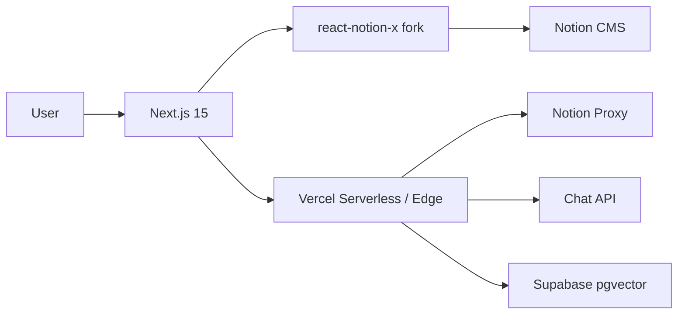

# Portfolio Website — v0.2.0


> Categories: **Hybrid SSG + serverless website** · **Production RAG pipeline** · **LangChain chat assistant** · **Admin dashboard** · **Dual design system** · **Full-stack telemetry**

## 1) Hybrid SSG + Serverless Website

- Next.js 15 + React 19 + custom `react-notion-x` fork
- ISR + serverless functions on Vercel
- Notion proxy API with 429 retry and exponential backoff
- Sitemap disk-cached in `.next/cache/notion-sitemap.json` (5 min dev / 60 min prod TTL) — protects against Notion rate limits on every server start
- Mermaid block rendering, SidePeek, Footer, Notion CSS overrides
- Mobile UX fixes: hamburger menu overlap, inline database item taps, SidePeek unclosable on mobile, UTF-16 surrogate pair sanitization on API inputs
- SEO/metadata improvements, `social-image` OG card generation

**Web Request Flow**



### react-notion-x Fork Workflow

- Maintained as a local fork with automated versioning (`7.7.1-jp.N`)
- `pnpm deps:use-local` / `pnpm deps:release` for local dev vs production switching
- Pre-push git hook blocks accidental pushes while in local-link mode

---

## 2) Dual Design System

Two themes coexist in a single CSS architecture:

| Theme | Scope | Applied via |
|---|---|---|
| **J·P Studio** (v1.1) | Admin + Chat UI | `data-theme="jp"` on root elements |
| **Notion** (legacy `--ai-*`) | Public Notion pages | default; no attribute needed |

- `styles/ai-design-system.css` — shared `--ai-*` primitives and `--brand-*` / `--gradient-*` tokens (primitive-only; no feature-layer styles)
- `styles/jp-theme.css` — `[data-theme="jp"]` token definitions and component overrides for J·P Lab surfaces
- `styles/notion-*.css` — Notion page layered styles: parity → feature → brand → legacy
- `styles/prism-theme.css` — syntax highlighting for code blocks
- Admin theme toggle (J·P ↔ Legacy) persisted in `localStorage('admin-theme')` via `hooks/use-admin-theme.ts`
- CSS guardrails enforced via `scripts/check-css-guardrails.mjs` (feature-layer styles must not appear in primitive files)

---

## 3) Production RAG Pipeline

**Ingestion & RAG Pipeline**

```mermaid
flowchart TD
  A[Notion / URL / Batch] --> B[Extract — jsdom + Readability]
  B --> C[Chunk — gpt-tokenizer\n450 tokens, 75-token overlap]
  C --> D[Embed — OpenAI text-embedding-3-small]
  D --> E[Upsert — Supabase pgvector]

  subgraph Auto-RAG Enhancements
    F[HyDE expansion]
    G[Query rewriting — precision / recall]
    H[Multi-query expansion]
    I[Cohere reranking]
    J[MMR deduplication]
    K[Per-doc metadata weighting]
  end

  E --> Auto-RAG Enhancements
```

### Ingestion

- `lib/rag/index.ts` — extraction, chunking, embedding, Supabase upsert, chunk diffing, ingest run tracking
- Document metadata types: `DocType` (profile, blog_post, kb_article, insight_note, project_article, photo, other), `PersonaType` (personal, professional, hybrid), `SourceType` (notion, url, file, github)
- Notion and URL metadata extraction (`lib/rag/notion-metadata.ts`, `lib/rag/url-metadata.ts`)
- Ingestion run lifecycle: `startIngestRun()` / `finishIngestRun()` with error logging

### Retrieval Enhancements (`lib/server/rag-enhancements.ts`)

- **HyDE**: generates a hypothetical answer document to improve embedding alignment
- **Reverse RAG** (query rewriting): precision mode (narrow recall) and recall mode (broader semantic search)
- **Multi-query expansion** (`lib/server/langchain/multi-query.ts`): expands to N sub-queries, selects best by HyDE/rewrite fallback
- **Cohere reranking**: `runCohereRerank()` cross-encoder reranking integration
- **MMR deduplication**: removes redundant chunks in retrieval window
- **Per-document metadata weighting**: configurable ranking weights per `doc_type` and `persona_type` via admin-managed config

### Auto-RAG Decision (`lib/server/rag/auto-rag-decision.ts`)

- Detects weak retrieval (low similarity, sparse results) and automatically selects enhancement strategy
- Configurable via chat advanced settings drawer

### Database Schema (`db/schema/schema.latest.sql`)

| Table | Purpose |
|---|---|
| `rag_documents` | Document state and metadata |
| `rag_ingest_runs` | Run records with status and error logs |
| `rag_chunks_*` | Embedding chunks per provider |
| `rag_snapshot` | Dataset snapshots with versioning |

---

## 4) LangChain Chat Assistant

**Chat API Architecture**

```mermaid
flowchart TD
  A[/api/chat.ts] --> B[Settings resolution\nchat-settings.ts]
  B --> C[/api/langchain_chat.ts]
  C --> D[langchain_chat_entry.ts\nEntry layer]
  D --> E[langchain_chat_impl.ts\nCore layer]
  E --> F[langchain_chat_impl_heavy.ts\nHeavy layer]
  F --> G[ragRetrievalChain.ts]
  F --> H[ragAnswerChain.ts]
  G --> I[Supabase pgvector]
  H --> J[LLM Provider]
```

### LangChain Chains (`lib/server/langchain/`)

- `ragRetrievalChain.ts` — retrieval with K-normalization, Cohere reranking, MMR, metadata weighting
- `ragAnswerChain.ts` — answer generation with formatted prompt templates and citation metadata
- `multi-query.ts` — multi-query expansion with HyDE/rewrite fallback selection

### Guardrail System (`lib/server/chat-guardrails.ts`)

- Intent routing: `knowledge` / `chitchat` / `command`
- Context window management with configurable history trimming
- History summarization for long sessions
- Budget enforcement and safe mode behavior
- Guardrail metadata headers on every response

### Multi-Provider LLM Support

| Provider | Via |
|---|---|
| OpenAI | `@ai-sdk/openai`, `openai` |
| Google Gemini | `@ai-sdk/google`, `@google/generative-ai` |
| Cohere | `cohere-ai` (reranking) |
| Ollama | `lib/local-llm/ollama-client.ts` |
| LM Studio | `lib/local-llm/lmstudio-client.ts` |

Provider selection driven by `lib/server/api/llm-provider-factory.ts` and the `LOCAL_LLM_BACKEND` env var.

### Chat Features

- Configurable session presets and summary prompt templates
- Response caching with TTL and cache key generation (`lib/server/chat-cache.ts`)
- Citation tracking with document metadata
- Streaming responses via SSE

### Chat UI (`components/chat/`)

- `ChatFullPage.tsx` — full-page chat interface
- `ChatFloatingWidget.tsx` / `ChatFloatingWindow.tsx` — floating widget mode
- `ChatAdvancedSettingsDrawer.tsx` — granular RAG and model settings panel
  - Model and provider selection
  - RAG controls: similarity threshold, K, HyDE, reverse RAG
  - Context history window configuration
  - Preset selection and display preferences
- `HistoryPreview.tsx` + `HistoryPreviewDiffPanel.tsx` — history window visualization with server/client diff
- Custom markdown renderer: `ChatMessageRenderer.tsx` + parse/node pipeline

---

## 5) Admin Dashboard

### Ingestion Dashboard (`/admin/ingestion`)

- `ManualIngestionPanel.tsx` — URL / Notion / batch ingestion with real-time SSE progress streaming
- `RagDocumentsOverview.tsx` — document count and status statistics
- `RecentRunsSection.tsx` — run history with status filtering
- `DatasetSnapshotSection.tsx` — versioned dataset snapshots
- `SnapshotPreviewPanel.tsx` — snapshot browsing and preview
- `SystemHealthSection.tsx` — health metrics

### Document Browser (`/admin/documents`)

- Document listing with metadata display
- Inline metadata editing: `DocType`, `PersonaType`, tags, public/private status
- Individual document detail page (`/admin/documents/[id]`)

### Chat Configuration Admin (`/admin/chat-config`)

| Card | Controls |
|---|---|
| `CoreBehaviorCard` | Temperature, max tokens, provider selection |
| `GuardrailCard` | Intent routing, fallback behavior |
| `CachingCard` | Response cache TTL and controls |
| `AllowlistCard` | User allowlist management |
| `NumericLimitsCard` | Quota and rate limits |
| `RagRankingCard` | Ranking weights per doc type and persona |
| `SessionPresetsCard` | Preset template editing |
| `SummaryPresetsCard` | Summary prompt templates |
| `TelemetryCard` | Telemetry sampling configuration |
| `RawConfigJsonModal` | Direct JSON config editing |

All admin pages use `AdminPageShell.tsx` which applies `data-theme="jp"` and loads Geist font.

---

## 6) Telemetry & Observability

**Dual-telemetry strategy**: Langfuse for LLM observability, PostHog for product analytics.

### Langfuse Integration

- LLM call tracing: generations, scores, metadata (`lib/server/telemetry/`)
- Telemetry configuration snapshots with content hashing and versioning
- Domain-based trace tagging: `rag`, `ingestion`, `notion`, `externalLLM`
- Async telemetry batching via `telemetry-buffer.ts`
- Span wrapping utilities (`withSpan.ts`) for structured trace nesting
- `telemetry-test-sink.ts` for test mode isolation

### Logging Infrastructure (`lib/logging/`)

- Domain-specific loggers: `rag`, `ingestion`, `notion`, `externalLLM`, `db`, `telemetry`
- Config hierarchy: DB config → env defaults → overrides → max bounds
- Environment-specific rules: local / preview / production
- `db-logger.ts` for database query tracing
- `client.ts` for client-side log shipping

---

## 7) Config & Tooling

### Environment Variables

```
# Core
NOTION_ROOT_PAGE_ID
OPENAI_API_KEY
SUPABASE_URL
SUPABASE_ANON_KEY
SUPABASE_SERVICE_ROLE_KEY

# Auth
ADMIN_DASH_USER
ADMIN_DASH_PASS

# Optional: Local LLM
LOCAL_LLM_BACKEND          # ollama | lmstudio
OLLAMA_BASE_URL
LMSTUDIO_BASE_URL

# Optional: Telemetry
LANGFUSE_PUBLIC_KEY
LANGFUSE_SECRET_KEY
NEXT_PUBLIC_POSTHOG_KEY

# Optional: Reranking
COHERE_API_KEY

# Tuning
NOTION_PAGE_CACHE_TTL
```

### Commands

```bash
pnpm dev
pnpm build
pnpm test
pnpm lint
pnpm typecheck

# Smoke & QA
pnpm smoke:chat
pnpm smoke:langchain-chat
pnpm smoke:admin-ui
pnpm qa:notion-polish
pnpm check:katex

# Validation
pnpm check:ai-docs
pnpm lint:css-guardrails

# Fork management
pnpm deps:use-local       # switch to local react-notion-x fork
pnpm deps:release         # release fork + switch back to remote
pnpm setup-hooks          # install pre-push safety hook
```

### Ingestion CLI

```bash
npx ts-node scripts/ingest-url.ts <url>
npx ts-node scripts/ingest-notion.ts <pageId>
```

---

## Credits

Base: **transitive-bullshit/nextjs-notion-starter-kit** · Author: **Jack H. Park** · Hosting: **Vercel** · CMS: **Notion**

---

## v0.1.0 — Initial Release

> Original feature set before the enhancements above.

- Next.js + React + `react-notion-x`
- ISR + Edge/Functions on Vercel
- Notion proxy API, Mermaid block rendering
- UX polish: SidePeek, Footer, Notion CSS overrides
- SEO/metadata improvements
- Ingestion UI (`/admin/ingestion`) + SSE progress
- CLI scripts (`scripts/ingest*.ts`) for batch runs
- Extraction: jsdom + Readability → Chunking: gpt-tokenizer
- Embeddings: OpenAI text-embedding-3-small → Supabase upsert
- Chat panel + Edge API (`/api/chat`) with streaming
