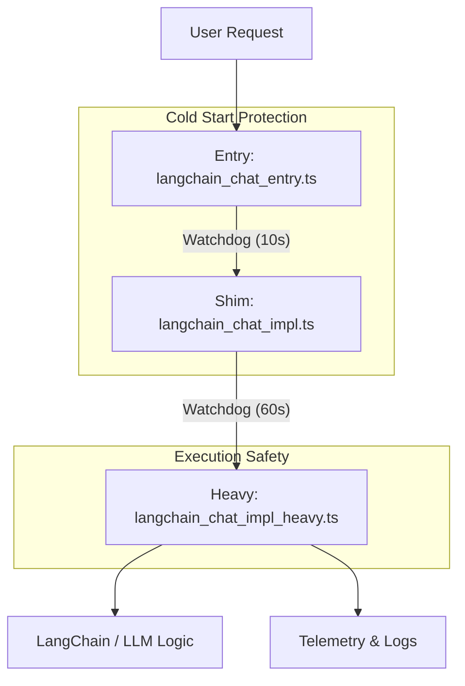

# LangChain Chat Architecture

## Overview

The `langchain_chat` API endpoint is structured into a **3-layer architecture** to ensure reliability, performance, and stability in a serverless environment (Next.js API Routes).

This design explicitly separates **initialization**, **loading**, and **execution** into distinct modules.

## Architecture Layers

### 1. Entry Layer (`langchain_chat_entry.ts`)

**Purpose:** Lightweight entry point.

- **Role:** Acts as the initial contact for the API request.
- **Key Constraint:** Must have **zero heavy dependencies**. No heavy libraries (like LangChain, Supabase, or AI SDKs) are imported at the top level.
- **Mechanism:**
  - Sets up a **Watchdog Timer** (10s default) immediately upon request receipt.
  - Dynamic imports the **Shim Layer** (`import("./langchain_chat_impl")`).
  - If the import takes too long (e.g., cold start contention), it fails gracefully with a 504 Gateway Timeout before the environment kills the process hard.

### 2. Shim Layer (`langchain_chat_impl.ts`)

**Purpose:** Safety buffer and pre-warning.

- **Role:** Manages the loading of the heavy business logic.
- **Mechanism:**
  - Uses its own watchdog for the heavy import.
  - **Pre-warming:** In non-production environments, it can trigger a background load of the heavy module to ensure it's ready for the next request.
  - **Error Handling:** Catches module loading errors (missing modules, timeouts) and returns structured JSON errors instead of crashing the process.

### 3. Heavy Implementation Layer (`langchain_chat_impl_heavy.ts`)

**Purpose:** Core business logic and execution.

- **Role:** Contains the actual LangChain graph, RAG logic, and AI model interactions.
- **Why Separate?**
  - **Telemetry Context Isolation:**
    - **Problem:** In the past, shared variables or poor scope management caused critical telemetry fields (like `sessionId`) to be overwritten by unrelated data (e.g., the user's last "question").
    - **Solution:** By isolating this complex logic in its own module, we ensure that `TelemetryContext` and trace buffers are scoped correctly per-request, preventing data pollution.
  - **Environment Stability (Smoke Tests vs. Server State):**
    - **Problem:** Smoke tests often checked functionality based on the _local shell environment_ (e.g., "I set `DEBUG_SURFACES=1` locally, so I expect debug output"). However, the _server_ might be running with different env vars.
- **Solution:** This layer encapsulates all logic that depends on server-side environment variables (like `DEBUG_SURFACES_ENABLED`). Tests now verify the _result_ of the server's state, rather than assuming the server matches the client's shell state.

## LangChain Execution Surface

### Entrypoint responsibilities

- `langchain_chat_impl_heavy.ts` orchestrates LangChain (`@langchain/core`) only after all guardrail, telemetry, and cache decisions have been made. It builds:
  - Guardrail config & runtime settings via the [Guardrail System](./guardrail-system.md) (`getChatGuardrailConfig`, `loadChatModelSettings`, `sanitizeChatSettings`).
  - Trace/telemetry contexts (`createTelemetryBuffer`, `decideTelemetryMode`, `buildSafeTraceInputSummary`, `emitAnswerGeneration`, `attachLangfuseTraceTags`).
  - Cache metadata helpers for response / retrieval hits (`buildCacheMetadata`, `updateTraceCacheMetadata`, `updateRetrievalMetadata`).
  - Guardrail meta snapshots sent to telemetry headers whenever summaries or context change (`serializeGuardrailMeta`).

### RAG retrieval chain (`lib/server/langchain/ragRetrievalChain.ts`)

- Triggered via `computeRagContextAndCitations` using `buildRagRetrievalChain()` (implemented as a `RunnableSequence` of reverse-RAG → HyDE → vector retrieval → reranker → context window) so each stage can emit Langfuse spans (`reverse_rag`, `hyde`, `retrieval`, `reranker`, `context:selection`).
- Retrieval runs within LangChain’s `RunnableLambda` hooks, allowing:
  - Automatic telemetry metadata creation (`buildTelemetryMetadata`) per span.
  - Supabase similarity search along with canonicalization/reranking hooks (`rewriteLangchainDocument`, `applyRanker`, `enrichAndFilterDocs`).
  - Guardrail-friendly context selection (`buildContextWindow`) plus telemetry reporting (selection quotas, deduplication stats).
- The heavy handler merges auto/multi query candidates (`mergeCandidates`) and decision telemetry (`decisionSignature`) before building the final context block and citations.

### Answer streaming chain (`lib/server/langchain/ragAnswerChain.ts`)

- Once the context is ready, LangChain builds a short `RunnableSequence`:
  1. `promptRunnable`: formats the guardrail prompt via `PromptTemplate` (`buildFinalSystemPrompt`, guardrail meta, memory/context sections).
  2. `llmRunnable`: streams the LLM response (`llmInstance.stream`) through `BaseLanguageModelInterface` implementations (Gemini/OpenAI/LM Studio/Ollama via `createChatModel`).
- Streaming chunks are rendered through `renderStreamChunk`, traced via `withSpan`/`buildTelemetryMetadata`, and cached (`memoryCacheClient.set`) once the stream completes.
  - `streamAnswerWithPrompt` also handles aborts, `OllamaUnavailableError`, PostHog capture, `responseCache` writes, and trace summaries (`buildSafeTraceOutputSummary`).

### Guardrail flow summary

- Input sanitization (`sanitizeMessages`, `applyHistoryWindow`) keeps history tokens within budgets and optionally builds `summaryMemory`, which is hashed via `computeHistorySummaryHash` to scope caching (summary changes invalidate response cache entries).
- Routing (`routeQuestion`) determines the intent (`knowledge`, `chitchat`, `command`) that gates retrieval vs fallback context, and this intent flows into Langfuse metadata, PostHog event properties, and guardrail tags.
- Guardrail meta headers (`X-Guardrail-Meta`) still include the latest context counts, dropped tokens, and enhancement summaries so UI clients can surface them without recomputing.

## Caching & Observability Notes

### Response cache correctness

- Response cache keys encode:
  - Guardrail/runtime flags (`ragTopK`, similarity, HyDE/rewrite/multi modes).
  - Langfuse-aligned identifiers (`resolvedProvider`, `requestedModelId`, `resolvedModelId`).
  - Summary digest (`historySummaryHash`) so trimmed history or summary generation flips the cache key.
- Cache hits update Langfuse metadata (`responseCacheStrategy`, `responseCacheHit`) and PostHog telemetry (`response_cache_hit`), while caching invariants ensure `insufficient` is only inferred when retrieval actually ran.

### Retrieval cache determinism

- Retrieval cache keys are computed via `buildRetrievalCacheKey` using the final guardrail candidate set (includes auto decision) and reused for both reads and writes.
- This means auto/multi retrieval runs (HyDE or rewrite reruns) still hit the cache when the same question/config reappears, preserving `retrieval_cache_hit` accuracy while avoiding stale contexts salted by alt query hashes.

## Operational impact

- Langfuse traces now observe more granular `rag` span metadata (`retrieve_k`, `final_k`, `candidates_selected`) thanks to `buildTelemetryMetadata` calls from the LangChain runnables.
- Response telemetry (Langfuse + PostHog) wires into the same `telemetryBuffer` traces, ensuring `answer_chars`, `citationsCount`, `cache_hit`, and `insufficient` values show up whether the response came from the cache or a live LLM stream.

## Diagram

## Historical Context & Rationale

This structure evolved essentially to solve two recurring incidents:

1.  **Telemetry Data Corruption:**
    Complex logic mixed with mutable state led to `sessionId` being replaced by chat messages in logs. The strict layering enforces cleaner scope boundaries.

2.  **Smoke Test Flakiness:**
    Tests incorrectly assumed that the client's `process.env` matched the server's runtime config. By isolating the "heavy" logic that relies on server envs, we force tests to treat the API as a black box, validating behavior based on response headers/body availability (Server State) rather than local assumptions.

## Cache Correctness Highlights

### Response cache scoping

- LangChain responses now key off the resolved provider/model pair and a digest of `historyWindow.summaryMemory`, preventing stale answers when the LLM switches (Gemini fallbacks, LM Studio substitutions) or when summaries trim history. The cache key payload mirrors the Langfuse metadata (`llmResolution`, guardrails/runtime flags) so telemetry and response cache semantics remain consistent.

### Retrieval cache determinism

- The retrieval cache key is computed _after_ the auto/multi (HyDE/rewrite) decision and reused for both reads and writes, avoiding the previous situation where an auto-generated alt query salted the write key and made identical requests miss. This keeps `retrieval_cache_hit` accurate while still allowing the latency savings of context reuse.

### Telemetry & Observability

- These cache improvements re-use existing telemetry hooks (`buildTelemetryMetadata`, `rag:root`, `safe trace summaries`) so dashboards continue to see consistent `cache.responseHit`, `rag.retrieval_attempted`, and `generation.cache_hit` indicators without needing extra instrumentation.
