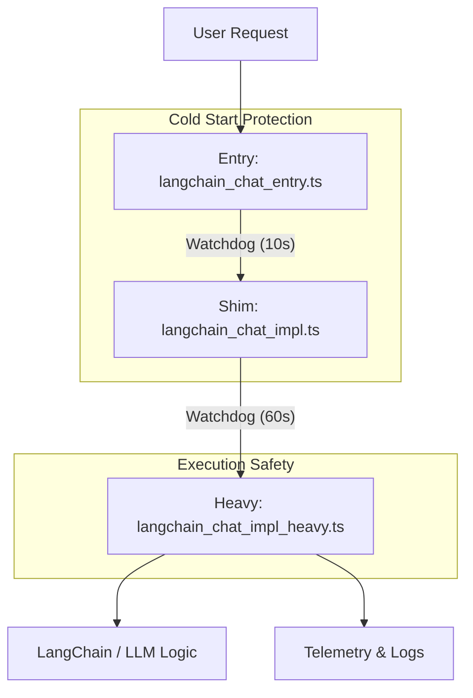

# LangChain Chat Architecture

## Overview

The `langchain_chat` API endpoint is structured into a **3-layer architecture** to ensure reliability, performance, and stability in a serverless environment (Next.js API Routes).

This design explicitly separates **initialization**, **loading**, and **execution** into distinct modules.

## Architecture Layers

### 1. Entry Layer (`langchain_chat_entry.ts`)

**Purpose:** Lightweight entry point.

- **Role:** Acts as the initial contact for the API request.
- **Key Constraint:** Must have **zero heavy dependencies**. No heavy libraries (like LangChain, Supabase, or AI SDKs) are imported at the top level.
- **Mechanism:**
  - Sets up a **Watchdog Timer** (10s default) immediately upon request receipt.
  - Dynamic imports the **Shim Layer** (`import("./langchain_chat_impl")`).
  - If the import takes too long (e.g., cold start contention), it fails gracefully with a 504 Gateway Timeout before the environment kills the process hard.

### 2. Shim Layer (`langchain_chat_impl.ts`)

**Purpose:** Safety buffer and pre-warning.

- **Role:** Manages the loading of the heavy business logic.
- **Mechanism:**
  - Uses its own watchdog for the heavy import.
  - **Pre-warming:** In non-production environments, it can trigger a background load of the heavy module to ensure it's ready for the next request.
  - **Error Handling:** Catches module loading errors (missing modules, timeouts) and returns structured JSON errors instead of crashing the process.

### 3. Heavy Implementation Layer (`langchain_chat_impl_heavy.ts`)

**Purpose:** Core business logic and execution.

- **Role:** Contains the actual LangChain graph, RAG logic, and AI model interactions.
- **Why Separate?**
  - **Telemetry Context Isolation:**
    - **Problem:** In the past, shared variables or poor scope management caused critical telemetry fields (like `sessionId`) to be overwritten by unrelated data (e.g., the user's last "question").
    - **Solution:** By isolating this complex logic in its own module, we ensure that `TelemetryContext` and trace buffers are scoped correctly per-request, preventing data pollution.
  - **Environment Stability (Smoke Tests vs. Server State):**
    - **Problem:** Smoke tests often checked functionality based on the _local shell environment_ (e.g., "I set `DEBUG_SURFACES=1` locally, so I expect debug output"). However, the _server_ might be running with different env vars.
    - **Solution:** This layer encapsulates all logic that depends on server-side environment variables (like `DEBUG_SURFACES_ENABLED`). Tests now verify the _result_ of the server's state, rather than assuming the server matches the client's shell state.

## Diagram

## Historical Context & Rationale

This structure evolved essentially to solve two recurring incidents:

1.  **Telemetry Data Corruption:**
    Complex logic mixed with mutable state led to `sessionId` being replaced by chat messages in logs. The strict layering enforces cleaner scope boundaries.

2.  **Smoke Test Flakiness:**
    Tests incorrectly assumed that the client's `process.env` matched the server's runtime config. By isolating the "heavy" logic that relies on server envs, we force tests to treat the API as a black box, validating behavior based on response headers/body availability (Server State) rather than local assumptions.
