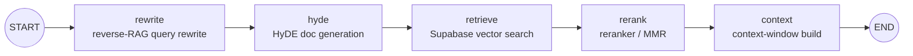
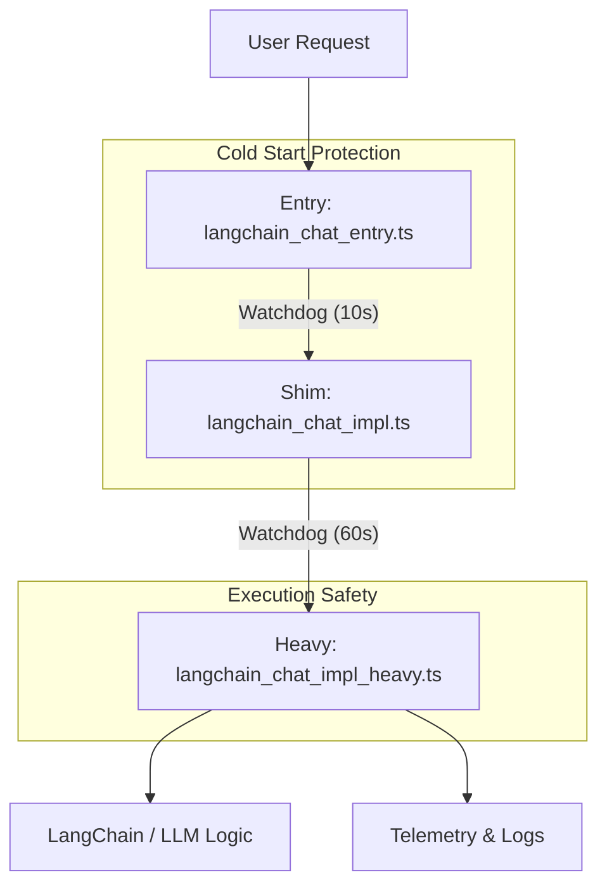

# LangChain Chat Architecture

## Overview

The `langchain_chat` API endpoint is structured into a **3-layer architecture** to ensure reliability, performance, and stability in a serverless environment (Next.js API Routes).

This design explicitly separates **initialization**, **loading**, and **execution** into distinct modules.

## Architecture Layers

### 1. Entry Layer (`langchain_chat_entry.ts`)

**Purpose:** Lightweight entry point.

- **Role:** Acts as the initial contact for the API request.
- **Key Constraint:** Must have **zero heavy dependencies**. No heavy libraries (like LangChain, Supabase, or AI SDKs) are imported at the top level.
- **Mechanism:**
  - Sets up a **Watchdog Timer** (10s default) immediately upon request receipt.
  - Dynamic imports the **Shim Layer** (`import("./langchain_chat_impl")`).
  - If the import takes too long (e.g., cold start contention), it fails gracefully with a 504 Gateway Timeout before the environment kills the process hard.

### 2. Shim Layer (`langchain_chat_impl.ts`)

**Purpose:** Safety buffer and pre-warning.

- **Role:** Manages the loading of the heavy business logic.
- **Mechanism:**
  - Uses its own watchdog for the heavy import.
  - **Pre-warming:** In non-production environments, it can trigger a background load of the heavy module to ensure it's ready for the next request.
  - **Error Handling:** Catches module loading errors (missing modules, timeouts) and returns structured JSON errors instead of crashing the process.

### 3. Heavy Implementation Layer (`langchain_chat_impl_heavy.ts`)

**Purpose:** Core business logic and execution.

- **Role:** Contains the actual LangChain graph, RAG logic, and AI model interactions.
- **Why Separate?**
  - **Telemetry Context Isolation:**
    - **Problem:** In the past, shared variables or poor scope management caused critical telemetry fields (like `sessionId`) to be overwritten by unrelated data (e.g., the user's last "question").
    - **Solution:** By isolating this complex logic in its own module, we ensure that `TelemetryContext` and trace buffers are scoped correctly per-request, preventing data pollution.
  - **Environment Stability (Smoke Tests vs. Server State):**
    - **Problem:** Smoke tests often checked functionality based on the _local shell environment_ (e.g., "I set `DEBUG_SURFACES=1` locally, so I expect debug output"). However, the _server_ might be running with different env vars.
- **Solution:** This layer encapsulates all logic that depends on server-side environment variables (like `DEBUG_SURFACES_ENABLED`). Tests now verify the _result_ of the server's state, rather than assuming the server matches the client's shell state.

## LangChain Usage Rationale

LangChain is used in targeted, bounded roles rather than as an end-to-end framework. The principle is: use it where it provides a concrete structural benefit, and keep domain logic (guardrails, telemetry, caching, abort handling) in plain TypeScript.

### Where LangChain adds value

#### `StateGraph` — sequential RAG pipeline (`lib/server/langchain/rag-retrieval-chain.ts`)

The five-stage retrieval pipeline (rewrite → HyDE → retrieve → rerank → context) is implemented as a LangGraph `StateGraph` rather than a manual chain of async function calls. The key benefits:

- **Named nodes → automatic observability.** Each node becomes a named span in Langfuse (via `CallbackHandler`) and a named run in LangSmith with no extra instrumentation code. This is non-trivial to replicate with plain functions.
- **`AbortSignal` between nodes.** `graph.invoke({ signal })` honors cancellation between node boundaries. Implementing this correctly in a manual pipeline requires propagating the signal through every function signature.
- **Serializable state channels.** `RagGraphAnnotation` channels hold only plain serializable step outputs. Non-serializable objects (Supabase client, `LangfuseTrace`, embeddings instance) are captured by closure in `buildRetrievalGraph()` rather than living in graph state — this prevents circular-reference errors in LangSmith/Langfuse trace payloads. The graph is constructed per-request precisely to enable this pattern.

#### `RunnableSequence` — answer streaming chain (`lib/server/langchain/rag-answer-chain.ts`)

The two-stage answer chain (prompt format → LLM stream) uses `RunnableSequence` with explicit `runName` labels. This gives LangSmith a clean named run tree for the answer generation step, and `RunnableLambda.withConfig({ runName })` lets the same names appear in both Langfuse (via `CallbackHandler`) and LangSmith without duplicating label logic. The chain is intentionally minimal: sanitization, caching, abort handling, and PostHog capture live outside it in plain TypeScript.

#### `BaseLanguageModelInterface` — provider abstraction (`lib/server/api/llm-provider-factory.ts`)

A single interface covers OpenAI, Gemini, Anthropic, LM Studio, and Ollama. The factory uses **dynamic imports** (`await import("@langchain/openai")` etc.) so provider SDKs are loaded on demand — providers not configured in a deployment don't contribute to the cold-start bundle. Without this abstraction, every call site would need a provider switch and each answer-chain and enhancement helper (`generateOnce`, `streamAnswerWithPrompt`) would carry its own dispatch table.

One provider-specific invariant: Claude Opus 4.8 and Fable reject `temperature` with HTTP 400 when their model catalog marks `supportsSampling: false`. The factory checks this flag and omits `temperature` accordingly — `@langchain/anthropic` handles this automatically only for older opus-4-7, so the factory handles newer models explicitly.

#### `ChatPromptTemplate` / `BaseMessage` — role-aware prompt assembly

Using `ChatPromptTemplate.formatMessages()` produces a proper `[SystemMessage, HumanMessage]` message pair. The alternative — a single `PromptTemplate` string with everything concatenated — folds the system prompt into the `user` turn, which causes providers (especially Anthropic) to misinterpret the instruction structure. The role separation is a correctness requirement, not a style preference.

#### `SupabaseVectorStore` — vector search abstraction

`SupabaseVectorStore.similaritySearchVectorWithScore()` issues the `match_documents` RPC call and unmarshals results into `Document` objects. The alternative is writing raw `pgvector` SQL and mapping results manually. The abstraction also keeps the retrieval logic consistent with the `EmbeddingsInterface` adapter (see below).

#### `EmbeddingsInterface` adapter — ingestion/query preprocessing consistency

`createEmbeddingsInstance()` wraps the project's own `embedTexts()` behind the `EmbeddingsInterface` shape expected by `SupabaseVectorStore`. Using `OpenAIEmbeddings` directly would apply its own preprocessing (e.g., stripping newlines), which differs from what `embedTexts` does at ingestion time. If query vectors and index vectors are generated with different preprocessing, similarity scores are silently skewed. Routing both through `embedTexts()` ensures they sit in the same embedding space.

---

### Where LangChain is deliberately not used

| Area | Why not |
|---|---|
| Higher-level chains (`RetrievalQA`, `ConversationalRetrievalChain`) | Each RAG stage needs custom telemetry, per-stage K normalization, and reranker hooks that higher-level chains hide or make awkward to override |
| Guardrail logic (`sanitizeMessages`, `buildContextWindow`, routing) | Plain async functions are simpler, easier to unit-test, and don't benefit from callback chains |
| Abort handling in the answer stream | `streamAnswerWithPrompt` handles `AbortError` with Next.js-specific response lifecycle logic; LangChain's callback-based cancellation doesn't integrate cleanly here |
| Error classification and telemetry hooks | Explicit `try/catch` at the call site keeps error types under our control and makes the Langfuse span metadata predictable |
| `OpenAIEmbeddings` directly | Would bypass the `embedTexts` preprocessing path used at ingestion time (see EmbeddingsInterface adapter above) |

---

## LangChain Execution Surface

### Entrypoint responsibilities

- `langchain_chat_impl_heavy.ts` orchestrates LangChain (`@langchain/core`) only after all guardrail, telemetry, and cache decisions have been made. It builds:
  - Guardrail config & runtime settings via the [Guardrail System](./guardrail-system.md) (`getChatGuardrailConfig`, `loadChatModelSettings`, `sanitizeChatSettings`).
  - Trace/telemetry contexts (`createTelemetryBuffer`, `decideTelemetryMode`, `buildSafeTraceInputSummary`, `emitAnswerGeneration`, `attachLangfuseTraceTags`).
  - Cache metadata helpers for response / retrieval hits (`buildCacheMetadata`, `updateTraceCacheMetadata`, `updateRetrievalMetadata`).
  - Guardrail meta snapshots sent to telemetry headers whenever summaries or context change (`serializeGuardrailMeta`).

### RAG retrieval chain (`lib/server/langchain/rag-retrieval-chain.ts`)

- Triggered via `computeRagContextAndCitations` using `runRagRetrieval()` — a **LangGraph `StateGraph`** that sequences reverse-RAG → HyDE → vector retrieval → reranker → context window as five named nodes. The graph is built per request (`buildRetrievalGraph`) so nodes can close over the request's clients/trace; state channels hold only serializable step outputs (keeping tracer payloads free of circular references).

```mermaid
flowchart LR
    START((START)) --> rewrite[rewrite<br/>reverse-RAG query rewrite]
    rewrite --> hyde[hyde<br/>HyDE doc generation]
    hyde --> retrieve[retrieve<br/>Supabase vector search]
    retrieve --> rerank[rerank<br/>reranker / MMR]
    rerank --> context[context<br/>context-window build]
    context --> END((END))
```

- **Observability (two-level tree).** Each LangGraph node emits a span via the `langfuse-langchain` `CallbackHandler`, and the `withSpan()` calls inside each stage emit detail spans (`reverse_rag`, `hyde`, `retrieval`, `reranker`, `context:selection`). Because our custom `LangfuseTrace` is not a `LangfuseTraceClient`, the node spans land in a **separate** Langfuse trace correlated to the primary one by `sessionId` (requestId) and a `linkedTraceId` metadata field — not a single nested tree. See [Trace topology](#trace-topology-langfuse--langsmith) for the trade-off.
- **LangSmith.** When `LANGSMITH_TRACING=true`, the same graph run is auto-traced to LangSmith (runName `rag-retrieval-graph`) with no extra code; Langfuse and LangSmith observe the run in parallel.
- Graph state is a single accumulating object (`RagGraphAnnotation`); each node reads prior results and returns its slice. Per-node work still includes:
  - Telemetry metadata creation (`buildTelemetryMetadata`) per span.
  - Supabase similarity search along with canonicalization/reranking hooks (`rewriteLangchainDocument`, `applyRanker`, `enrichAndFilterDocs`).
  - Guardrail-friendly context selection (`buildContextWindow`) plus telemetry reporting (selection quotas, deduplication stats).
- Aborts are honored between nodes via the `signal` passed to `graph.invoke`.
- The heavy handler merges auto/multi query candidates (`mergeCandidates`) and decision telemetry (`decisionSignature`) before building the final context block and citations.

### Answer streaming chain (`lib/server/langchain/rag-answer-chain.ts`)

- Once the context is ready, LangChain builds a short `RunnableSequence`:
  1. `promptRunnable`: formats the guardrail prompt via `ChatPromptTemplate.formatMessages()` into a `[SystemMessage, HumanMessage]` pair (`buildFinalSystemPrompt`, guardrail meta, memory/context in the system message; the question as the human message). This replaced a single-string `PromptTemplate`, so the system prompt now reaches providers as a `system` role instead of being folded into a `user` turn.
  2. `llmRunnable`: streams the LLM response (`llmInstance.stream`) through `BaseLanguageModelInterface` implementations (Gemini/OpenAI/LM Studio/Ollama via `createChatModel`).
- Streaming chunks are rendered through `renderStreamChunk`, traced via `withSpan`/`buildTelemetryMetadata`, and cached (`memoryCacheClient.set`) once the stream completes.
  - `streamAnswerWithPrompt` also handles aborts, `OllamaUnavailableError`, PostHog capture, `responseCache` writes, and trace summaries (`buildSafeTraceOutputSummary`).

### Guardrail flow summary

- Input sanitization (`sanitizeMessages`, `applyHistoryWindow`) keeps history tokens within budgets and optionally builds `summaryMemory`, which is hashed via `computeHistorySummaryHash` to scope caching (summary changes invalidate response cache entries).
- Routing (`routeQuestion`) determines the intent (`knowledge`, `chitchat`, `command`) that gates retrieval vs fallback context, and this intent flows into Langfuse metadata, PostHog event properties, and guardrail tags.
- Guardrail meta headers (`X-Guardrail-Meta`) still include the latest context counts, dropped tokens, and enhancement summaries so UI clients can surface them without recomputing.

## Trace topology (Langfuse + LangSmith)

The RAG retrieval graph is observed by three layers at once:

| Layer | Mechanism | Where it lands |
| --- | --- | --- |
| Node-level (LangGraph) | `langfuse-langchain` `CallbackHandler` | A **separate** Langfuse trace, correlated via `sessionId` + `linkedTraceId` |
| Stage-detail | explicit `withSpan()` inside each stage | The **primary** Langfuse trace |
| Full graph | LangChain auto-tracer (`LANGSMITH_TRACING`) | LangSmith run `rag-retrieval-graph` |

### Why node spans are a separate Langfuse trace

`CallbackHandler` can only nest under a Langfuse `root` of type `LangfuseTraceClient`/`LangfuseSpanClient`. This project uses a thin custom `LangfuseTrace` (see `lib/langfuse.node.ts`) that is **not** that client type, so the handler opens its own trace instead of nesting. The two traces are joined by correlation fields, not by parent/child edges.

### Decision: unify into one tree vs. keep correlated-but-separate

| | **Unify (single nested tree)** | **Keep separate (current)** |
| --- | --- | --- |
| Langfuse UX | One trace; node → detail spans nested | Two traces; jump via `linkedTraceId`/`sessionId` |
| Work required | Wrap our trace in a `LangfuseTraceClient` adapter **or** migrate the custom `LangfuseTrace` to the `@langfuse/client` v4 OTEL span API | None — already working |
| SDK risk | Forces reconciling `@langfuse/client@4.x` (primary spans) with the `langfuse@3.x` bundled by `langfuse-langchain` | Each SDK stays in its lane; no version reconciliation |
| Blast radius | Touches every existing `withSpan()` call site | Isolated to `runRagRetrieval` |
| LangSmith | Unaffected — LangSmith already shows the full nested graph | Unaffected |

**Recommendation: keep separate for now.** LangSmith already provides the single, fully-nested view of the graph (which is the primary "see the whole structure" need), so the Langfuse-side unification buys mostly cosmetic consolidation at the cost of an SDK-version reconciliation that would ripple through every `withSpan()` call. Revisit unification only if/when the primary trace migrates to the `@langfuse/client` v4 OTEL span API, at which point `CallbackHandler` can nest under a real span `root` cheaply.

## Caching & Observability Notes

### Response cache correctness

- Response cache keys encode:
  - Guardrail/runtime flags (`ragTopK`, similarity, HyDE/rewrite/multi modes).
  - Langfuse-aligned identifiers (`resolvedProvider`, `requestedModelId`, `resolvedModelId`).
  - Summary digest (`historySummaryHash`) so trimmed history or summary generation flips the cache key.
- Cache hits update Langfuse metadata (`responseCacheStrategy`, `responseCacheHit`) and PostHog telemetry (`response_cache_hit`), while caching invariants ensure `insufficient` is only inferred when retrieval actually ran.

### Retrieval cache determinism

- Retrieval cache keys are computed via `buildRetrievalCacheKey` using the final guardrail candidate set (includes auto decision) and reused for both reads and writes.
- This means auto/multi retrieval runs (HyDE or rewrite reruns) still hit the cache when the same question/config reappears, preserving `retrieval_cache_hit` accuracy while avoiding stale contexts salted by alt query hashes.

## Operational impact

- Langfuse traces now observe more granular `rag` span metadata (`retrieve_k`, `final_k`, `candidates_selected`) thanks to `buildTelemetryMetadata` calls from the LangChain runnables.
- Response telemetry (Langfuse + PostHog) wires into the same `telemetryBuffer` traces, ensuring `answer_chars`, `citationsCount`, `cache_hit`, and `insufficient` values show up whether the response came from the cache or a live LLM stream.

## Diagram

```mermaid
flowchart TD
    User[User Request] --> Entry[Entry: langchain_chat_entry.ts]

    subgraph "Cold Start Protection"
        Entry -- Watchdog (10s) --> Shim[Shim: langchain_chat_impl.ts]
    end

    subgraph "Execution Safety"
        Shim -- Watchdog (60s) --> Heavy[Heavy: langchain_chat_impl_heavy.ts]
    end

    Heavy --> LangChain[LangChain / LLM Logic]
    Heavy --> Telemetry[Telemetry & Logs]
```

## Historical Context & Rationale

This structure evolved essentially to solve two recurring incidents:

1.  **Telemetry Data Corruption:**
    Complex logic mixed with mutable state led to `sessionId` being replaced by chat messages in logs. The strict layering enforces cleaner scope boundaries.

2.  **Smoke Test Flakiness:**
    Tests incorrectly assumed that the client's `process.env` matched the server's runtime config. By isolating the "heavy" logic that relies on server envs, we force tests to treat the API as a black box, validating behavior based on response headers/body availability (Server State) rather than local assumptions.

## Cache Correctness Highlights

### Response cache scoping

- LangChain responses now key off the resolved provider/model pair and a digest of `historyWindow.summaryMemory`, preventing stale answers when the LLM switches (Gemini fallbacks, LM Studio substitutions) or when summaries trim history. The cache key payload mirrors the Langfuse metadata (`llmResolution`, guardrails/runtime flags) so telemetry and response cache semantics remain consistent.

### Retrieval cache determinism

- The retrieval cache key is computed _after_ the auto/multi (HyDE/rewrite) decision and reused for both reads and writes, avoiding the previous situation where an auto-generated alt query salted the write key and made identical requests miss. This keeps `retrieval_cache_hit` accurate while still allowing the latency savings of context reuse.

### Telemetry & Observability

- These cache improvements re-use existing telemetry hooks (`buildTelemetryMetadata`, `rag:root`, `safe trace summaries`) so dashboards continue to see consistent `cache.responseHit`, `rag.retrieval_attempted`, and `generation.cache_hit` indicators without needing extra instrumentation.
