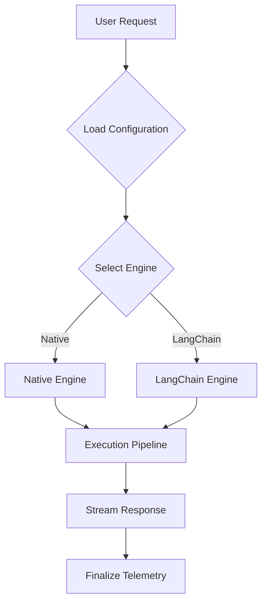
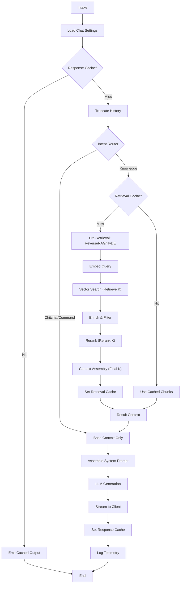

# RAG System Architecture

**Status:** authoritative  
**Owner:** Engineering  
**Implementation:** `pages/api/chat.ts`, `pages/api/native_chat.ts`, `pages/api/langchain_chat.ts`

This document serves as the authoritative guide to the Retrieval-Augmented Generation (RAG) system. It describes the decision paths, invariants, and configuration knobs that determine how a user's chat request becomes an answer.

---

## 1. System Overview & Design Principles

The RAG system is designed to provide high-fidelity, grounded answers from a knowledge base while maintaining strict correctness and PII safety.

### Core Principles

1.  **Deterministic Behavior over Heuristics:** Where possible, decisions (like engine selection or ranking) are driven by explicit configuration (presets, admin config) rather than opaque runtime guesses.
2.  **Clear Separation of Concerns:**
    - **Decision Layer:** Determines _what_ to do (e.g., `chat-guardrails.ts`, `chat-settings.ts`).
    - **Execution Layer:** Performs the action (e.g., `native_chat.ts`, `ragRetrievalChain.ts`).
    - **Telemetry Layer:** Observes the result without affecting execution (`telemetry-buffer.ts`).
3.  **PII-Safe Observability:** Telemetry and logging are designed to be safe by default. Detailed traces (inputs/outputs) are gated by `LANGFUSE_INCLUDE_PII` and `isPlainObject` checks to prevent accidental leakage.
4.  **Progressive Enhancement:** The system functions without RAG. Features like "Reverse RAG" or "HyDE" are additive layers that enhance quality but can be disabled or fail gracefully without breaking the core chat experience.
5.  **Cache Correctness:** Caching keys are aggressive and include configuration state (e.g., specific top-K, similarity thresholds) to ensure that a configuration change immediately invalidates stale, incompatible cached entries.

### Invariants

- **Context Budget is Hard:** The system will never exceed the configured `ragContextTokenBudget`. If retrieved documents exceed this, they are dropped or clipped starting from the lowest-ranked items.
- **Guarded Retrieval:** Retrieval is only attempted if the intent classifier (`routeQuestion`) determines the query needs knowledge, or if forced by configuration.
- **Traceability:** Every answer produced by the system generates a structured telemetry event (PostHog and/or Langfuse) describing _why_ it was produced.

---

## 2. End-to-End Request Lifecycle

The lifecycle of a request flows from the Next.js API handler through configuration resolution, engine dispatch, and finally into an execution pipeline.

### High-Level Flow (Conceptual)



### Detailed Execution Flow (Native Engine)



### Detailed Execution Steps

1.  **Request Intake:**
    - The request hits `pages/api/chat.ts`.
    - **`loadChatModelSettings`** is called immediately to resolve the effective configuration based on the user's session and admin defaults.

2.  **Engine Dispatch:**
    - Based on `runtime.engine`, the request is routed to either `nativeChat` (`pages/api/native_chat.ts`) or `langchainChat` (`pages/api/langchain_chat.ts`).
    - _Note:_ The "Native" engine is the default and preferred path for performance and control.

3.  **Guardrails & Routing (Native Path):**
    - **`minimizeHistory`**: The conversation history is truncated to fit `historyTokenBudget`.
    - **`routeQuestion`**: The user's latest message is analyzed to determine intent (`knowledge`, `chitchat`, `command`).
      - _Knowledge:_ Triggers retrieval.
      - _Chitchat/Command:_ Bypasses retrieval to save cost and latency.

4.  **Retrieval & Ranking (If Knowledge):**
    - If a cache hit occurs (`retrievalCacheTtl > 0`), this step is skipped.
    - Otherwise, the system executes **Pre-Retrieval** (Rewriting/HyDE), **Vector Search**, and **Reranking**.

5.  **Generation:**
    - A final system prompt is assembled using `buildFinalSystemPrompt`.
    - The context (preserved history + retrieved chunks) is injected.
    - The LLM streams the response to the client.

6.  **Telemetry Finalization:**
    - On stream completion, metrics (latency, token usage, retrieval metadata) are flushed to PostHog and Langfuse.

---

## 3. Engine Selection & Execution Models

The system supports two distinct execution engines. This is a fundamental architectural fork.

### 1. Native Engine (`pages/api/native_chat.ts`)

- **Philosophy:** "Metal" implementation. Direct calls to database, vector store, and LLM APIs.
- **Pros:** Maximum control, easier debugging, lower overhead, finer-grained telemetry.
- **Cons:** More boilerplate code.
- **When to use:** Default for all standard RAG, local LLM, and high-performance use cases.

### 2. LangChain Engine (`pages/api/langchain_chat.ts`)

- **Philosophy:** Structured chain composition. Uses `RunnableSequence`.
- **Pros:** Access to LangChain ecosystem features (though many are reimplemented in Native for control).
- **Cons:** Heavy abstraction/stack traces, "lazy loading" complexity (see `langchain_chat_entry.ts`).
- **When to use:** Legacy support, or when prototyping complex multi-step agents that rely heavily on LangChain primitives.

### Decision Logic

Engine selection is determined by `lib/server/chat-settings.ts`:

1.  **Session Config:** Did the user explicitly request `engine: "lc"` in the UI?
2.  **Preset Config:** Does the active preset specify `chatEngine`?
3.  **Defaults:** defined in `getChatModelDefaults()` (currently defaults to "native" logic via `getChatModelDefaults` or specific env vars).

**Fallback Semantics:**
If a Local LLM is required but unavailable (e.g., LM Studio is not running), the system logic in `loadChatModelSettings` can optionally modify the resolution to fall back to a cloud provider, but the _Engine_ choice generally remains sticking unless the fallback requires a switch (rare).

---

## 4. Retrieval Strategy & Modes

The retrieval pipeline determines _what_ knowledge is fetched. This logic is shared (`lib/server/chat-rag-utils.ts`) but orchestrated differently by each engine.

### Decision Decisions

- **Intent-Based Retrieval:** Controlled by `routeQuestion` in `chat-guardrails.ts`.
  - Classes: `knowledge` (fetch), `chitchat` (skip), `command` (skip).
  - _Override:_ Admin config can force retrieval for all queries, but this is generally discouraged.

### Retrieval Components (The Pipeline)

1.  **Reverse RAG (Query Rewriting):**
    - **Goal:** De-ambiguate the user's query using conversation history.
    - **Config:** `reverseRagEnabled` / `reverseRagMode`.
    - **Input:** User Query + History.
    - **Output:** Standalone search query.

2.  **HyDE (Hypothetical Document Embeddings):**
    - **Goal:** Generate a hallucinated "ideal answer" to embed, capturing semantic meaning better than a raw question.
    - **Config:** `hydeEnabled`.
    - **Input:** Rewritten Query.
    - **Output:** A hypothetical passage.
    - **Embedding Target:** We embed the _HyDE document_ if generated, otherwise the _Rewritten Query_.

3.  **Multi-Query (LangChain experimental):**
    - **Goal:** Generate multiple variations of a query to increase recall.
    - **Status:** Currently experimental and primarily visible in the LangChain heavy implementation (`ragRetrievalChain.ts`).

---

## 5. Candidate Selection, Ranking, and Reduction

Once a query vector exists, the system must turn it into a compact context window.

### 1. Vector Search (Supabase)

- **Function:** `matchRagChunksForConfig` (Native) or `SupabaseVectorStore` (LangChain).
- **Mechanism:** `rpc` call to Postgres `pgvector` store.
- **Function:** `matchRagChunksForConfig` (Native) or `SupabaseVectorStore` (LangChain).
- **Mechanism:** `rpc` call to Postgres `pgvector` store.
- **Candidate K (Sizing Logic):** The system fetches a larger pool of candidates than the final Top K to allow for effective reranking and filtering.
  - `finalK` = `guardrails.ragTopK` (The user/preset desired count).
  - `retrieveK` = `max(finalK * 4, RAG_TOP_K)`. We intentionally over-fetch (typically 4x) to ensure quality after potential metadata filtering.
  - `rerankK` = `min(retrieveK, available_candidates)`. The reranker operates on the full valid retrieved set.
  - `outputK` = `min(finalK, rerankK)`. The final context window receives only the best survivors.

### 2. Enrichment & Filtering

- **Shared Logic:** `enrichAndFilterDocs` in `chat-rag-utils.ts`.
- **Metadata Fetch:** Secondary query to `rag_documents` to get fresh metadata (like `is_public` or updated titles) that might be stale in the vector store.
- **Filtering:** Documents with `is_public: false` (if enforced) are dropped here.
- **Weighting:** Metadata weights (configured in admin settings) are applied to boost/penalize scores.

### 3. Reranking (Optional)

- **Logic:** `applyRanker` in `rag-enhancements.ts`.
- **Modes:**
  - `none`: Pass-through vector scores.
  - `cohere`: Uses `CohereClient.rerank`.
  - `similarity`: (No-op, relies on base vector similarity).

### 4. Context Window Assembly

- **Logic:** `buildContextWindow` in `chat-guardrails.ts`.
- **Algorithm:** Greedy packing.
  1.  Sort candidates by final score (descending).
  2.  Add candidates until `ragContextTokenBudget` is reached.
  3.  If a candidate partially fits, it is clipped (if `ragContextClipTokens` allows).
- **Output:** `ContextWindowResult` containing the final string block and citation metadata.

---

## 6. Prompt Assembly & Answer Generation

The final prompt sent to the LLM is a composition of system instructions, retrieved context, and conversation history.

### System Prompt Construction

Source: `buildFinalSystemPrompt` in `chat-settings.ts`.

- **Order:**
  1.  `baseSystemPrompt` (Global Admin Config)
  2.  `preset.additionalSystemPrompt` (Preset Specific)
  3.  `sessionConfig.additionalSystemPrompt` (User/Session Specific)
- **Behavior:** These are concatenated with newline separators.

### Context Injection

- The retrieved knowledge is injected into the user's message or a specific system slot, depending on the engine.
- **Format:** Typically a structured block:
  ```text
  <context>
  [Source 1]: Content...
  [Source 2]: Content...
  </context>
  ```

### Streaming Response

- Both engines utilize streaming to reduce Time-To-First-Byte (TTFB).
- **Native:** Manually pumps chunks from the provider (OpenAI/Gemini/Ollama) to `res.write`.
- **LangChain:** Uses `Runnable.stream` pipe.

---

## 7. Caching Semantics & Correctness

The system employs granular caching to minimize latency and cost. It is critical to understand _what_ makes a cache key.

### Two-Stage Caching

1.  **Retrieval Cache (`chat:retrieval:...`)**
    - **Stores:** `ContextWindowResult` (the final list of retrieved and filtered chunks).
    - **Key Components:** Query text, `ragTopK`, `similarityThreshold`, `candidateK`, `ragRanking` (indirectly), and `presetId`.
    - **TTL:** Configurable via `adminConfig.cache.retrievalTtlSeconds`.
    - **Invariant:** Changing even a minor retrieval knob (e.g., Top K from 5 to 6) invalidates this cache automatically because the hash changes.

2.  **Response Cache (`chat:response:...`)**
    - **Stores:** The final LLM text output.
    - **Key Components:** `presetId`, `intent`, Full History (`messages`), `ragTopK` (if knowledge).
    - **TTL:** Configurable via `adminConfig.cache.responseTtlSeconds`.
    - **Behavior:** If hit, the system replays the cached text immediately and emits telemetry marking it as a `cache_hit`.

### Insufficient Context caching

- If the system performs retrieval but finds "insufficient" context (score < threshold), this result _is_ cached.
- Subsequent queries will quickly see "insufficient context" and fallback to general knowledge (if allowed) without hitting the vector DB again.

---

## 8. Telemetry & Observability Contract (PII-Safe)

The system treats telemetry as a first-class citizen with a stable contract.

### Dual Backend

- **PostHog:** High-level metrics (latency, token counts, error rates).
- **Langfuse:** Detailed traces (LLM calls, retrieval inputs/outputs).

### Contracts

1.  **PII Gating:**
    - By default, `input` and `output` fields in traces are _undefined_ or simplified summaries.
    - Only if `LANGFUSE_INCLUDE_PII=true` (env) do we log the actual user query and full retrieved chunks.
2.  **Stable Metadata:**
    - Keys like `chat_session_id`, `trace_id`, `preset_key` are always present.
    - `retrieval_attempted`: boolean indicating if the vector store was queried.
    - `retrieval_used`: boolean indicating if any chunks were actually included in the context (score > threshold).
3.  **Observation Merging:**
    - The `telemetry-buffer` allows multiple stages (e.g., retrieval, reranking, generation) to append to the same trace object in a thread-safe manner (via `async_hooks` or explicit passing).

---

## 9. Failure Modes & Fallbacks

| Failure Mode               | Behavior                                                            | User Impact                                                      |
| :------------------------- | :------------------------------------------------------------------ | :--------------------------------------------------------------- |
| **Vector DB Down**         | `matchRagChunks` throws error. Caught in `matchRagChunksForConfig`. | Request fails with 500 (Native) or specific error JSON.          |
| **Local LLM Offline**      | `loadChatModelSettings` detects unavailability.                     | If `fallbackChitchat` allowed, falls back. Otherwise error.      |
| **Context Limit Exceeded** | `buildContextWindow` clips chunks.                                  | Answers may be less detailed; user sees truncated citation list. |
| **Streaming Abort**        | Client disconnects or `AbortController` fires.                      | Stream ends early. Telemetry acts as "partial" or "aborted".     |

---

## 10. Configuration & Tuning Map

### Configuration Hierarchy (Precedence)

The system resolves configuration in the following strict order (highest priority first), defined in `loadChatModelSettings`:

1.  **Session Config (User Override)**
    - _Source:_ `req.body.config` (from UI "Advanced Settings" drawer).
    - _Scope:_ Applies only to the current request.
    - _Example:_ User manually selecting `gpt-4` or `engine: "lc"`.
2.  **Preset Config (Admin DB)**
    - _Source:_ `admin_chat_config` table (Supabase).
    - _Scope:_ Applied via `presetId` (e.g., "fast", "highRecall").
    - _Example:_ A "Creative" preset might force `temperature: 0.9` and `ragTopK: 0`.
3.  **System Defaults (Env/Hardcoded)**
    - _Source:_ `getChatModelDefaults()` and environment variables (`RAG_TOP_K`, `DEFAULT_SYSTEM_PROMPT`).
    - _Scope:_ Fallback for any missing value.

### Tuning Knobs

Use `admin_chat_config` (Supabase) to tune these values.

| Goal                     | Knob to Change                                                   | Trade-off                                       |
| :----------------------- | :--------------------------------------------------------------- | :---------------------------------------------- |
| **Increase Recall**      | `numeric.ragTopK` (increase)                                     | Higher latency, more input tokens (cost/speed). |
| **Reduce Hallucination** | `numeric.similarityThreshold` (increase)                         | More "I don't know" answers (false negatives).  |
| **Improve Latency**      | `numeric.ragTopK` (decrease) or `retrievalTtlSeconds` (increase) | Less comprehensive answers.                     |
| **Force Retrieval**      | Disallow `chitchat`/`command` intents (via prompts)              | Wasted resources on "Hello".                    |

---

## 11. Mental Model Summary

**"The Funnel"**
Think of the RAG system as a funnel that starts wide and aggressively filters down:

1.  **Intent Filter:** "Do we even need to search?" (Route Question)
2.  **Vector Filter:** "What looks vaguely similar?" (Top-K \* M candidates)
3.  **Metadata Filter:** "Is this legally/logically allowed?" (is_public)
4.  **Ranker Filter:** "What is actually relevant?" (Reranker)
5.  **Budget Filter:** "What fits in the prompt?" (Token Budget)

**If you change X, Y happens:**

- If you change the **System Prompt**, the entire "personality" changes, but retrieval logic remains identical.
- If you change **RAG Top K**, the cache invalidates, and we fetch more data.
- If you switch **Engines**, the _logic_ (steps) remains similar, but the _code path_ changes entirely.

**Common Misconception:**

- _Myth:_ "LangChain engine is better because it's LangChain."
- _Reality:_ The Native engine is often faster and more observable because it avoids abstraction overhead. Use Native unless you need a specific LangChain-only agent feature.
