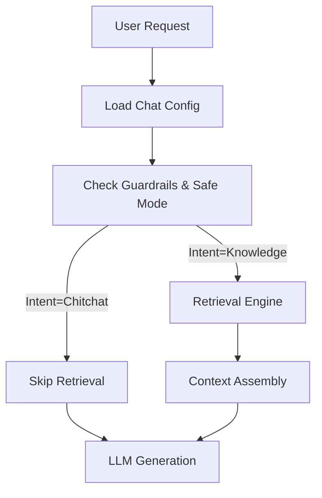

# RAG System Architecture

**Status:** authoritative
**Owner:** Engineering
**Implementation:** `pages/api/chat.ts`, `lib/server/api/langchain_chat_impl_heavy.ts`

This document outlines the high-level architecture of the RAG (Retrieval-Augmented Generation) system. For detailed implementation guides, see the sub-documents below.

---

## 1. Core Components

The RAG system is split into two distinct pipelines:

- **[Ingestion Pipeline](./rag-ingestion-pipeline.md)** (Write Path)
  - Handles fetching data from **Notion** and **URLs**.
  - Performs change detection, chunking (`450` tokens), and embedding updates.
  - Manages vector persistence in Supabase.

- **[Retrieval Engine](./rag-retrieval-engine.md)** (Read Path)
  - Handles **Auto-RAG** decision logic (HyDE, Query Rewriting).
  - Executes vector search via Postgres RPCs.
  - Performs ranking (`DocType` weighting) and context assembly.

---

## 2. Request Lifecycle

The RAG system is integrated into the Chat Assistant's request flow:

### Key interactions

- **Guardrails:** If `Safe Mode` is enabled, the Retrieval Engine is bypassed entirely.
- **Context:** Retrieved chunks are deduplicated and fitted into the `ragContextTokenBudget`.

---

## 3. Data Model (Supabase)

The system uses `pgvector` on Supabase. Storage is normalized to separate document metadata from vector data.

### Tables

| Table                     | Purpose                     | Key Columns                          |
| :------------------------ | :-------------------------- | :----------------------------------- |
| **`rag_documents`**       | Canonical metadata store    | `doc_id`, `content_hash`, `metadata` |
| **`rag_chunks_openai_*`** | Vector partition for OpenAI | `chunk_hash`, `embedding` (1536d)    |
| **`rag_chunks_gemini_*`** | Vector partition for Gemini | `chunk_hash`, `embedding` (768d)     |
| **`rag_ingest_runs`**     | Ingestion job telemetry     | `status`, `error_logs`, `stats`      |

---

## 4. Telemetry

Observability is enforced across both pipelines:

- **Ingestion:** Each run is logged to `rag_ingest_runs`.
- **Retrieval:** Decisions (Base vs Auto) are captured in Langfuse traces (`decisionSignature`) and PostHog (`rag_enabled`, `response_cache_hit`).
- **Snapshots:** The `rag_snapshot` table captures daily volume metrics (total docs, chunks).
