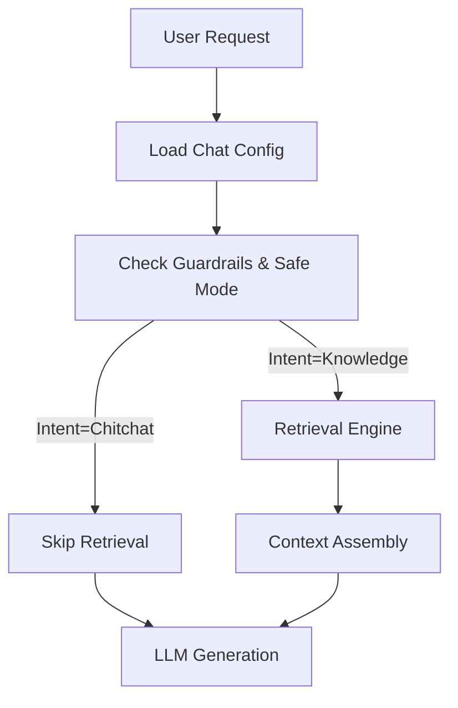

# RAG System Architecture

> **Derives from canonical:** [RAG System](../../canonical/rag/rag-system.md)
> This document is role-specific; it must not redefine the canonical invariants.
> If behavior changes, update the canonical doc first, then reflect here.

**Status:** derived reference  
**Owner:** Engineering  
**Implementation:** `pages/api/chat.ts`, `lib/server/api/langchain_chat_impl_heavy.ts`

This page connects the canonical architecture to the runtime artifacts (Supabase tables, telemetry hooks, request flows) you deal with when extending or debugging the chat endpoint. The high-level contracts live in [RAG System](../../canonical/rag/rag-system.md); this doc assumes those invariants.

---

## 1. Runtime Observability & Instrumentation

The lifecycle mirrors the canonical request flow, but this section highlights the signals and components surfaced to engineers.

### Key operational notes

- Guardrail routing (`Safe Mode`, intent filtering) complies with the guardrail contract and emits `X-Guardrail-Meta` for downstream diagnostics.
- Context assembly obeys the canonical dedupe/quota/token invariants before prompt construction, so instrumentation can assume `finalK` and `includedCount` semantics described in `rag-system`.

---

## 2. Data Model (Supabase)

The tables below back the ingestion and retrieval subsystems referenced in the canonical architecture.

### Tables

| Table                     | Purpose                     | Key Columns                          |
| :------------------------ | :-------------------------- | :----------------------------------- |
| **`rag_documents`**       | Canonical metadata store    | `doc_id`, `content_hash`, `metadata` |
| **`rag_chunks_openai_*`** | Vector partition for OpenAI | `chunk_hash`, `embedding` (1536d)    |
| **`rag_chunks_gemini_*`** | Vector partition for Gemini | `chunk_hash`, `embedding` (768d)     |
| **`rag_ingest_runs`**     | Ingestion job telemetry     | `status`, `error_logs`, `stats`      |

---

## 3. Telemetry

Observability follows the canonical guardrails and alerts; these notes describe where the signals land.

- **Ingestion:** Each run writes a record to `rag_ingest_runs` for freshness and error auditing.
- **Retrieval:** `decisionSignature`, `rag:root`, and Langfuse/PostHog events tag [Auto-RAG](../00-start-here/terminology.md#auto-rag) decisions with `rag_enabled`, `response_cache_hit`, and selection metadata.
- **Snapshots:** The `rag_snapshot` table captures daily volume metrics (total docs, chunks) referenced by the canonical dashboards.
