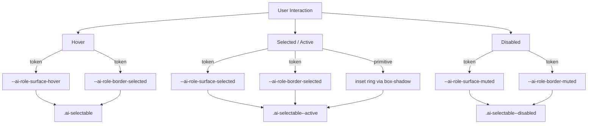

# AI Design System Guidelines

This document outlines the architecture and principles of the AI Design System, maintaining a clean separation between the **Style Layer** (CSS) and the **Component Layer** (React), while leveraging **Tailwind CSS** for layout and utility-first styling.

## Canonical Contract

**Status:** Canonical  
**Defines:**

- the token system (BG/text/role tokens) that powers every color, border, and interaction state.
- the primitives- vs. feature-layer separation, ensuring `styles/ai-design-system.css` remains primitive-only.
- the interaction contract (Selectable primitives, tokens, InteractionScope) that unifies hover/active states.
- the engineering conventions (Tailwind + `cn`, file naming) that keep the system consistent.
  **Invariants:**
- No raw color literals appear in primitive CSS or component styles; only role/text/accent tokens may surface.
- Interaction states are driven by shared primitives (e.g., `.ai-selectable`) and their tokens, not per-feature overrides.
- Dark mode and border/contrast expectations remain tied to the defined tokens so theme changes flow automatically.
  **Derived documents:**
- [../css-guardrails.md](../css-guardrails.md)
- [../ui/color-contract.md](../ui/color-contract.md)
- [../ui/color-audit.md](../ui/color-audit.md)
  **Change rule:** If this contract changes, update derived docs in the same PR.

---

## 1. Guiding Principles (The "Why")

- **Minimalist Hierarchy**: Use typography and subtle borders instead of heavy fills to create separation.
- **Elevation & Physicality**: Components should feel tangible but light. Use `ai-shadow-soft` for subtle depth.
- **Clarity over Deco**: Visual elements (icons, badges) should always serve a functional purpose, such as indicating status or provider type.
- **Adaptive Resilience**: Design must work seamlessly in both light and dark modes via theme tokens.

---

## 2. Technical Infrastructure

### A. Tailwind CSS Integration

The design system is bridged to Tailwind via `tailwind.config.cjs`. This allows using design tokens directly as utility classes:

- **Colors**: `bg-ai-bg`, `text-ai-fg`, `border-ai-border`, `bg-ai-accent`.
- **Radii**: `rounded-ai`, `rounded-ai-sm`.
- **Shadows**: `shadow-ai-soft`.

### B. The `cn` Utility

Always use the `cn` helper (from `@/lib/utils`) for merging class names. It uses `tailwind-merge` to resolve conflicts intelligently.

```tsx
import { cn } from "@/lib/utils";
<div className={cn("p-4 border-ai-border", className)} />;
```

---

## 3. The Style Layer (Global CSS & Tokens)

The foundational styles are defined in `styles/ai-design-system.css`.

### A. Design Tokens

Always use tokens instead of hardcoded values.
| Type | Example Tokens | Tailwind Equivalent |
| :--- | :--- | :--- |
| **Color** | `var(--ai-bg)`, `var(--ai-fg)` | `bg-ai-bg`, `text-ai-fg` |
| **Radius** | `var(--ai-radius-md)` | `rounded-ai` |
| **Shadow** | `var(--ai-shadow-soft)` | `shadow-ai-soft` |

### B. Global CSS Primitives

- **Typography**: `.ai-label-overline` (metadata), `.ai-helper-text` (desc), `.ai-text-muted`.
- **Interactivity**: `.focus-ring`, `.ai-selectable--active`.

---

### C. Interaction Management

- **InteractionScope**: A context-aware wrapper used to propagate UI states (disabled, loading, readOnly) down the component tree automatically.
  - `disabled`: Prevents all interaction and applies "greyed out" styling.
  - `loading`: Primarily for buttons; shows a spinner and prevents clicks. Also disables nested inputs.
  - `readOnly`: For inputs; prevents modification but maintains higher visibility/contrast than `disabled`.

---

### D. Selectable & Interaction Contract (Unified Model)

The design system defines a **single, shared interaction contract** for all selectable surfaces (tiles, allowlist rows, preset cards, clickable wrappers around checkboxes/toggles). This prevents per-feature hover/selected styling and guarantees consistent behavior across light and dark modes.

#### Core Concept

- **Interaction strength is owned by tokens**, not by components.
- **State behavior is owned by primitives**, not by features.
- Components opt into the contract by applying shared primitives and modifiers.

#### Contract Diagram



#### Required CSS Primitives

- `.ai-selectable`
  - Baseline surface (uses `--ai-role-surface-1`)
  - Neutral border and subtle ambient shadow

- `.ai-selectable--hoverable`
  - Applies hover surface + accent border ring

- `.ai-selectable--active`
  - Applies selected surface
  - Applies accent border
  - Applies **one or more inset rings** for toggle-level clarity

- `.ai-selectable--disabled`
  - Uses muted surface and border
  - Suppresses hover and active affordances

#### Design Rules

- **Never implement hover/selected styles per feature.**
- **Never hardcode colors for interaction states.**
- All interaction contrast is adjusted by tuning:
  - `--ai-role-surface-hover`
  - `--ai-role-surface-selected`
  - `--ai-role-border-selected`

This ensures that improving or fixing interaction clarity happens in one place and automatically propagates to all selectable UI.

---

## 4. UI Primitives & Patterns (React Layer)

### A.- **Atomic Primitives** (`components/ui/`):

- `Button`, `Input`, `Select`, `Switch`, `Checkbox`: Core interactive elements that consume `InteractionScope`.
- `Tooltip`: Accessible tooltip implementation using `@radix-ui/react-tooltip`.
- `Card`, `Section`, `HeadingWithIcon`: Structural building blocks.

### B. Higher-Order Patterns

- **[card.tsx](file:///Users/jackpark/Local%20Code%20Repositories/nextjs-react-notion-x/components/ui/card.tsx)**: Structural cards using `.ai-card`.
- **[meta-card.tsx](file:///Users/jackpark/Local%20Code%20Repositories/nextjs-react-notion-x/components/ui/meta-card.tsx)**: **[NEW]** Diagnostic display for telemetry and guardrail data.
- **[field.tsx](file:///Users/jackpark/Local%20Code%20Repositories/nextjs-react-notion-x/components/ui/field.tsx)**: Combines Label + Control + Helper text.

---

## 5. Naming & Engineering Conventions

### File Naming

| Target                  | Naming           | Example                |
| :---------------------- | :--------------- | :--------------------- |
| **Atomic UI Component** | `kebab-case.tsx` | `button.tsx`           |
| **Feature Component**   | `PascalCase.tsx` | `ChatMessageItem.tsx`  |
| **Global Styles**       | `kebab-case.css` | `ai-design-system.css` |

### Grounding Rules for Implementation

1.  **Utility-first for layout, tokens for visuals.** Only use `@apply` for complex component-specific logic.
2.  **No hardcoded colors.** Use tokens (`hsl(var(--ai-...))`) or `color-mix` for transparency.
3.  **Interaction over props.** Prefer `InteractionScope` for managing groups of disabled/loading/readOnly states.
4.  **Accessibility is first-class.** Always use descriptive labels and prefer the React `Tooltip` component (Radix UI) over manual `data-tooltip` implementations.

---

## 6. Color & Role Contracts (Merged)

This section captures the **surface**, **border**, **divider**, and **interaction** roles that every component should share.

### A. Surface Roles

- **Base surface**: `--ai-surface` / `bg-ai` is the default card/panel fill, `--ai-bg` is the layout background anchor.
- **Subtle surfaces**: `--ai-surface-muted`, `--ai-surface-tint`, and `--ai-bg-muted` provide layered depth without switching palettes.
- **DO**
  - Use `bg-[color:var(--ai-surface)]`, `bg-ai`, or `bg-[color-mix(in srgb,var(--ai-bg),var(--ai-border),<ratio>)]` for cards and dropdowns.
  - Layer hover/press states by blending `var(--ai-surface)` with `var(--ai-accent)` or `var(--ai-border)` using `color-mix`.
  - Prefer token-driven classes (`bg-ai-muted`, `bg-[var(--ai-bg-muted)]`) over repeating literal HSL/hex values.
- **DON’T**
  - Hardcode opaque hex strings (`#fff`, `#1f2027`, etc.) for UI surfaces.
  - Create once-off surface fills inside components; reuse the surface tokens instead of inventing new ones.

### B. Border Roles

- **Base and accent borders**: `--ai-border` is the default stroke, with `--ai-border-soft`, `--ai-border-muted`, and `--ai-border-strong` spacing the visual hierarchy.
- **DO**
  - Apply `border-[color:var(--ai-border)]`, `border-ai`, `border-[color-mix(in srgb,var(--ai-border) 70%, transparent)]`, etc.
  - For focus/hover outlines, use `focus-visible:ring-[color:var(--ai-ring)]` and keep `border` widths consistent with the Tailwind tokens.
  - Favor subtle divider strokes (`--ai-divider`) for lists and sheet separators.
- **DON’T**
  - Mix custom border colors per component; we want one portable set so global themes can shift.
  - Drop in brand-specific colors (e.g., `border-color: #ff0000`) inside reusable primitives.

### C. Divider Roles

- **Separator token**: `--ai-divider` ensures vertical and horizontal separators maintain weight and opacity without clashing with backgrounds.
- **DO**
  - Use `border-[color:var(--ai-divider)]` or `bg-[color:var(--ai-divider)]` for thin splits inside panels.
  - Reserve `--ai-divider` for structural splits, not status badges.
- **DON’T**
  - Add custom `rgba`/`hsl` values for separators; they disrupt the intended contrast ratios.

### D. Interaction Roles

- **Accent colors**: `--ai-accent`, `--ai-accent-strong`, `--ai-accent-soft`, `--ai-accent-bg` power links, primary buttons, and badges.
- **Status colors**: `--ai-success`, `--ai-warning`, `--ai-error` plus their `*-muted` variants drive success/error/warning states.
- **Focus/hover rings**: `--ai-ring` and `--ai-pill-*` tokens describe outlines and pill backgrounds.
- **DO**
  - Tie `hover:bg`, `active:bg`, `focus:ring`, and `text` variants to the tokens above (e.g., `hover:bg-[color-mix(in srgb,var(--ai-accent),var(--ai-bg),15%)]`).
  - Use semantic tokens like `bg-[var(--ai-error-muted)]` or `text-[var(--ai-success)]` for feedback messaging.
  - When necessary, use `color-mix` to adjust opacity while staying anchored to a base token.
- **DON’T**
  - Use standalone interaction colors (e.g., `hover:text-[#1d4ed8]`) that bypass theme tokens.
  - Re-implement accent shades per component; extend the existing tokens or add new ones to `styles/ai-design-system.css` before using them in UI code.
