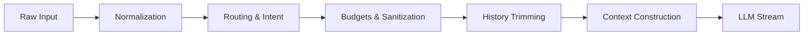

# Chat Guardrail System

**Status:** authoritative  
**Owner:** Engineering  
**Implementation:** `lib/server/chat-guardrails.ts`, `lib/server/api/langchain_chat_impl_heavy.ts`

The Guardrail System is the safety and control layer that sits between the user's raw input and the LLM execution. It ensures every request is normalized, budgeted, and routed correctly before any expensive retrieval or generation occurs.

## Canonical Contract

**Status:** Canonical  
**Defines:**
- the guardrail pipeline (normalization, routing, sanitization, history trimming, context construction) that mediates before any LLM work.
- the budget and safe mode behavior that clamps history/context tokens, enforces quoting, and skips retrieval when needed.
- the enforcement philosophy that keeps UI toggles as capability switches rather than forced behaviors.
**Invariants:**
- UI toggles (e.g., for retrieval, [Reverse RAG](../00-start-here/terminology.md#reverse-rag), [HyDE](../00-start-here/terminology.md#hyde)) enable capabilities but never override [Auto-RAG](../00-start-here/terminology.md#auto-rag) sovereignty or guardrail routing.
- Safe Mode always disables retrieval/enhancements and applies the guarded budget caps (context/history/token budgets).
- Budget enforcement and sanitization rules are consistently applied for every session/config resolution.
**Derived documents:**
- [../chat/advanced-settings-ux.md](../chat/advanced-settings-ux.md)
- [../chat/session-presets.md](../chat/session-presets.md)
- [../analysis/advanced-settings-ownership-audit.md](../analysis/advanced-settings-ownership-audit.md)
- [../operations/chat-user-guide.md](../operations/chat-user-guide.md)
**Change rule:** If this contract changes, update derived docs in the same PR.

---

## 1. Pipeline Overview

The guardrail pipeline executes in a strict sequence for every chat request:



### 1. Normalization

**Function:** `normalizeQuestion`

- **Whitespace:** Collapses multiple spaces and trims.
- **Canonicalization:** Creates a lowercase, alphanumeric-only version for pattern matching (detecting "chitchat" or "commands").
- **Language Detection:** Simple heuristic (`en`, `ko`, `mixed`) to aid downstream processing.

### 2. Routing & Intent

**Function:** `routeQuestion`
The system classifies the user's intent to decide if retrieval is necessary.

| Intent      | Trigger                                                   | retrieval   | fallback                        |
| :---------- | :-------------------------------------------------------- | :---------- | :------------------------------ |
| `command`   | Matches keywords (e.g., "reset", "deploy")                | **Skipped** | Uses `fallbackCommand` prompt.  |
| `chitchat`  | Matches conversational patterns (e.g., "hello", "thanks") | **Skipped** | Uses `fallbackChitchat` prompt. |
| `knowledge` | Default fallback                                          | **Active**  | Runs full RAG pipeline.         |

### 3. Sanitization & Budgets

**Function:** `sanitizeChatSettings`
Configurations (from Admin Presets or Session Overrides) are clamped to safe ranges to prevent abuse or instability.

| Setting                 | Default       | Safe Mode               |
| :---------------------- | :------------ | :---------------------- |
| `ragContextTokenBudget` | ~1200 tokens  | **600 tokens**          |
| `historyTokenBudget`    | ~900 tokens   | **300 tokens**          |
| `ragTopK`               | 5 - 10 chunks | N/A (Retrieval skipped) |

**[Safe Mode](../00-start-here/terminology.md#safe-mode):** When `safeMode=true`, budgets are aggressively reduced, and retrieval is disabled entirely.

### 4. History Trimming

**Function:** `applyHistoryWindow`

- Reverses through the chat history (newest to oldest).
- Accumulates messages until `historyTokenBudget` is reached.
- **Summary Hash:** Generates a stable hash of the implemented memory (or summary) to ensure the **Response Cache** is invalidated if the active history window changes.

### 5. Context Construction

**Function:** `computeRagContextAndCitations`

- **If Intent = Knowledge:** Orchestrates the RAG pipeline ([HyDE](../00-start-here/terminology.md#hyde), Vector Search, Reranking).
- **If Intent = Chitchat/Command:** Injects the static fallback prompts into the context.

---

## 2. Guardrail Metadata (`X-Guardrail-Meta`)

Every response includes an `X-Guardrail-Meta` header (serialized JSON) providing transparency into the pipeline's decisions.

**Structure:**

```typescript
interface GuardrailMeta {
  intent: "knowledge" | "chitchat" | "command";
  usage: {
    historyTokens: number;
    contextTokens: number;
    totalTokens: number;
  };
  budgets: {
    history: number;
    context: number;
  };
  dropped: {
    historyMessages: number;
    contextChunks: number;
  };
}
```

**UI Usage:** The frontend uses this to display "Context Used" badges or diagnostics about why a message might have been ignored (e.g., "History truncated").

---

## 3. Safe Mode Behavior

[Safe Mode](../00-start-here/terminology.md#safe-mode) is an operational fallback used during incidents or high load. It strictly enforces:

1.  **Zero Retrieval:** Vector search is skipped.
2.  **Zero Enhancements:** [HyDE](../00-start-here/terminology.md#hyde)/[Reverse RAG](../00-start-here/terminology.md#reverse-rag) are disabled.
3.  **Minimal Budgets:** Context/History budgets are halved.

Use `safeMode=true` in Admin Presets to recover from vector database outages or latency spikes.
