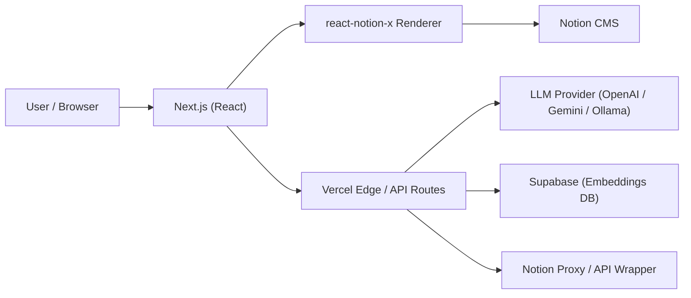
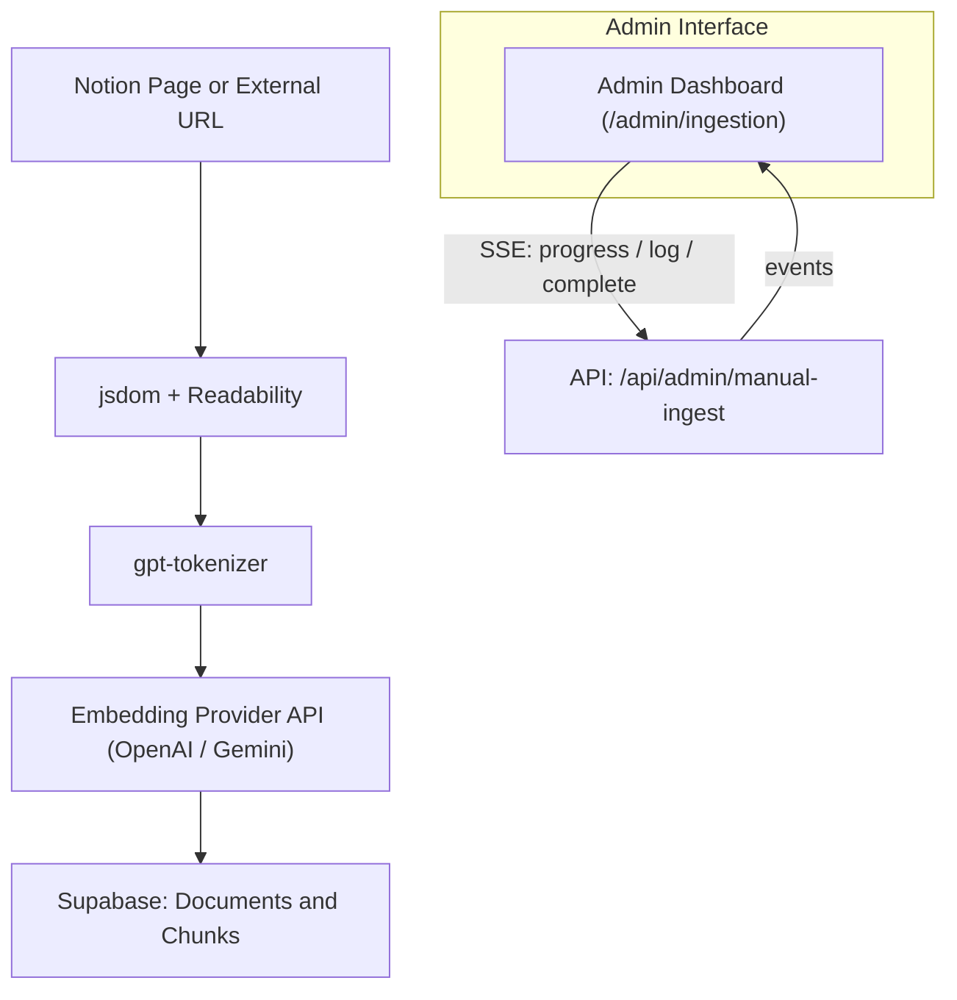

# RAG Pipeline & LangChain Integration — System Overview (Updated 2025)

## 💬 Project Overview: Hybrid RAG Pipeline + Conversational AI Chat

**Purpose:**  
This project demonstrates how a modern Retrieval-Augmented Generation (RAG) system works end‑to‑end, including ingestion, embeddings, vector search, multi‑model LLM reasoning, and two execution runtimes: a **Native Engine** and a **LangChain Engine**.

It is designed as a portfolio‑ready explanation for PMs, engineers, and interviewers to understand not only _what_ was built, but _why_.

---

## 🎯 Objectives

This project aims to provide a practical understanding of:

- How **RAG pipelines** ingest, chunk, vectorize, and retrieve knowledge
- How **semantic embeddings** support accurate similarity search
- The differences between **custom pipelines** and **framework orchestration (LangChain)**
- Real‑world architectural trade‑offs: latency, modularity, debugging, and extensibility
- Multi‑provider LLM workflows, including **OpenAI, Gemini, and local Ollama (Mistral)**

---

## ⚙️ High-Level Architecture (Updated)

```mermaid
flowchart TD
  subgraph "Admin Ingestion"
    A["Data Sources: Notion / URLs / Files"]
    B["Text Extraction (jsdom + Readability)"]
    C["Chunking (gpt-tokenizer)"]
    D["Embedding Provider API (OpenAI / Gemini)"]
    E["Supabase Storage (pgvector, space_id-based tables)"]
    A --> B --> C --> D --> E
  end

  subgraph "Conversational Chat"
    U["User Query"]
    N["Native RAG Engine (Edge Runtime)"]
    L["LangChain RAG Engine (Node Runtime)"]
    R["Supabase Vector Search (rag_chunks_{space_id})"]
    H["LLM Providers (OpenAI / Gemini / Ollama)"]
    O["Final Response"]
    U --> N --> R --> H --> O
    U --> L --> R --> H --> O
```

---

## 🧩 Key System Components (Updated)

### 1. **Multi‑Provider Embeddings**

Unlike the earlier single‑provider design, the system now supports:

- **OpenAI text-embedding‑3-small**
- **Gemini embeddings**

All embeddings are stored in **Supabase pgvector** under provider‑specific tables:

```
rag_chunks_{space_id}
match_chunks_{space_id}
```

### 2. **Multi‑Provider Reasoning LLMs**

Users can select from:

- OpenAI (gpt‑4o, gpt‑4o‑mini, etc.)
- Gemini 1.5
- **Ollama (local Docker runtime, default: Mistral)**

### 3. **Two Execution Engines**

| Engine               | Runtime      | Strength                            | Notes                                                   |
| -------------------- | ------------ | ----------------------------------- | ------------------------------------------------------- |
| **Native Engine**    | Edge Runtime | Fastest, streaming-first            | Supports Reverse RAG, HyDE, multi-stage query rewriting |
| **LangChain Engine** | Node Runtime | Most modular, clearer orchestration | Ideal for debugging, evaluation, chain composition      |

---

## 🧠 Retrieval Pipeline (Updated Workflow)

### 🔄 Full Query Flow (Native Engine Highlights)

1. **Query Rewrite (Reverse RAG)** – small LLM
2. **HyDE (Hypothetical Document Generation)** – optional
3. **Embedding + Similarity Search** (Supabase pgvector)
4. **Context Assembly + Token Budget Enforcement**
5. **Reasoning LLM Generation**
6. **Streaming Output to UI**

Native Engine includes advanced retrieval augmentations that LangChain does not perform by default.

---

## 🔗 LangChain RAG Pipeline (Updated)

While the Native Engine includes additional augmentations, the LangChain pipeline remains a clear, modular reference implementation:

```
User → Retriever → Context Builder → Prompt → Reasoner → Parser → Citation Mapper
```

Updated steps:

| Step | Component                         | Description                  |
| ---- | --------------------------------- | ---------------------------- |
| 1    | SupabaseVectorStore.asRetriever() | Retrieves top‑k chunks       |
| 2    | Runnable Context Builder          | Prepares clean context text  |
| 3    | PromptTemplate                    | Injects question + context   |
| 4    | ChatOpenAI / Gemini / HF          | Multi‑provider LLM reasoning |
| 5    | StringOutputParser                | Clean parsing                |
| 6    | Custom Citation Mapper            | Adds source metadata         |

---

## 🚀 End-to-End Workflow (Updated)

1. **Ingestion**  
   Extract, clean, chunk, and embed using the selected provider.

2. **Storage**  
   Persist vectors into provider‑specific Supabase tables using a `space_id`.

3. **Retrieval**  
   Top‑k similarity search via pgvector.

4. **Generation**  
   The user‑selected engine (Native or LangChain) calls the chosen LLM provider.

5. **Streaming & UX**  
   Native Engine streams tokens for superior conversational experience.

---

## 📚 PM Learning Outcomes

- Architecting multi‑provider LLM workflows
- Understanding hybrid runtime design (Edge + Node + local Docker)
- Practical insights into embeddings, vector search, and token budgeting
- Comparing FAST vs MODULAR pipelines through real implementation
- Ability to communicate AI system trade‑offs clearly during interviews

---

## 🧾 Tech Stack (Updated)

| Layer      | Technology                             | Purpose                      |
| ---------- | -------------------------------------- | ---------------------------- |
| Frontend   | Next.js (React)                        | Chat UI with streaming       |
| Vector DB  | Supabase + pgvector                    | Multi‑space embeddings       |
| Embeddings | OpenAI / Gemini / HF                   | Configurable providers       |
| LLMs       | OpenAI / Gemini / HF / Ollama          | Multi‑provider reasoning     |
| Runtimes   | Edge + Node + Docker                   | Native vs LangChain vs Local |
| Utilities  | jsdom, Readability, gpt-tokenizer, SSE | Ingestion + streaming        |

---

## 🎯 Summary

This project illustrates a **modern, flexible, multi‑provider RAG architecture** that spans:

- **Edge-native streaming**
- **LangChain orchestration**
- **Configurable embeddings**
- **Local LLM runtime support**
- **Vector-based semantic retrieval**

It is designed to be both a practical learning exercise and a professional portfolio showcase.

# Next.js + Notion Portfolio Framework


> A customized evolution of the [Next.js Notion Starter Kit](https://github.com/transitive-bullshit/nextjs-notion-starter-kit), rebuilt for an **AI-integrated personal portfolio website** featuring Notion CMS, RAG ingestion, and an Edge-based Chat Assistant.

---

## 🚀 Features

### 🧱 Hybrid SSG + Serverless

- Built with **Next.js + React**, deployed on **Vercel Edge Runtime**
- Supports **Incremental Static Regeneration (ISR)** for fast yet dynamic content
- Dynamic Notion rendering powered by **react-notion-x**

### 🧩 RAG + Admin Ingestion + Chat Assistant

- End-to-end document ingestion pipeline (manual + batch modes)
- Semantic embeddings via configurable providers (**OpenAI**, **Gemini**) stored in **Supabase**
- `/admin/ingestion` dashboard with real-time progress (SSE streaming)
- Built-in **Chat Assistant** with a floating panel UI and streaming responses
- Optional **Ollama (local)** provider (Mistral by default) for on-device chat responses via Docker/Ollama
- Multi-provider embeddings supporting **OpenAI** and **Gemini**, stored in provider-specific Supabase pgvector spaces.
- Multi-provider LLM execution across **OpenAI**, **Gemini**, and **local Ollama (Mistral)**.
- Native Engine includes advanced retrieval features such as **Reverse RAG**, **HyDE**, and multi-stage query rewriting.

### 🎨 Enhanced UI/UX

- Custom **Notion CSS overrides** for better readability and layout control
- Integrated **Mermaid diagram** rendering
- **SidePeek** panel animations for smoother navigation
- SEO-optimized meta tags and Open Graph previews

---

## ⚙️ Setup

1. **Clone and install**

   ```bash
   git clone https://github.com/jack-h-park/nextjs-react-notion-x
   cd nextjs-react-notion-x
   pnpm install
   ```

2. **Configure environment variables**
   Create a `.env.local` file:

   ```bash
   ADMIN_DASH_USER=admin
   ADMIN_DASH_PASS=secret
   NOTION_PAGE_CACHE_TTL=300

   DEFAULT_LLM_MODEL="OpenAI gpt-4o-mini"
   EMBEDDING_PROVIDER=openai
   EMBEDDING_MODEL_ID=text-embedding-3-small
   EMBEDDING_VERSION=v1
   # EMBEDDING_MODEL="OpenAI text-embedding-3-small (v1)" (legacy alias)
   # EMBEDDING_SPACE_ID=openai_te3s_v1
   # GOOGLE_API_KEY=...
   OPENAI_API_KEY=sk-...
   SUPABASE_URL=https://your-project.supabase.co
    SUPABASE_ANON_KEY=...
   SUPABASE_SERVICE_ROLE_KEY=...
   ```

````

### 🔧 Advanced LLM/RAG tuning

The assistant ships with sensible defaults, but you can fine‑tune behaviour via the following knobs:

| Variable | Default | Description |
| --- | --- | --- |
| `DEFAULT_LLM_MODEL` | `OpenAI gpt-4o-mini` | Combined provider + model alias for chat responses (e.g. `OpenAI gpt-4o-mini`, `Gemini 1.5 Flash`). |
| `EMBEDDING_PROVIDER` | `openai` | Canonical provider for the embedding space, used together with `EMBEDDING_MODEL_ID`. |
| `EMBEDDING_MODEL_ID` | `text-embedding-3-small` | Canonical model identifier; pairs with `EMBEDDING_PROVIDER` and `EMBEDDING_VERSION` to derive the embedding space. |
| `EMBEDDING_VERSION` | `v1` | Version suffix used in table/RPC names (`openai_te3s_v1`). |
| `EMBEDDING_MODEL` | `OpenAI text-embedding-3-small (v1)` | Legacy space alias kept for backwards compatibility; normalized to the canonical fields above. |
| `EMBEDDING_SPACE_ID` | `openai_te3s_v1` | (Optional) Explicit embedding space identifier (`rag_chunks_{space}` / `match_chunks_{space}`) for advanced setups. |
| `RAG_TOP_K` | `15` | How many chunks to fetch per query before context compression. Raise this when your corpus is small and you want broader coverage. |
| `LLM_TEMPERATURE` | `0.0` | Sampling temperature for answers. Keep near zero for factual Q&A, raise for more creative tone. |
| `RAG_SIMILARITY_THRESHOLD` | `0.78` | Minimum cosine similarity required before a chunk can be included in the context window. |
| `CHAT_CONTEXT_TOKEN_BUDGET` | `1200` | Total token budget earmarked for retrieved excerpts per response. |
| `CHAT_CONTEXT_CLIP_TOKENS` | `320` | Maximum size of any single excerpt (extra tokens are trimmed). |
| `CHAT_HISTORY_TOKEN_BUDGET` | `900` | Conversation history token limit before the guardrails collapse older turns into a summary. |
| `CHAT_SUMMARY_ENABLED` | `true` | Enables the rolling summary feature once the history budget is exceeded. |
| `CHAT_SUMMARY_TRIGGER_TOKENS` | `400` | When a single conversation surpasses this many tokens, the summary pass is triggered. |
| `CHAT_SUMMARY_MAX_TURNS` | `6` | Maximum turns (pairs of user/assistant messages) considered when generating a summary. |
| `CHAT_SUMMARY_MAX_CHARS` | `600` | Hard character cap for the generated summary so it fits inside the prompt. |
| `CHAT_CHITCHAT_KEYWORDS` | `"hello,hi,how are you,whats up,what is up,tell me a joke"` | Comma-separated phrases treated as lightweight chitchat and answered without hitting Supabase. |
| `CHAT_FALLBACK_CHITCHAT_CONTEXT` | _(string)_ | Prompt snippet injected whenever a chitchat intent is detected; useful for defining tone. |
| `CHAT_FALLBACK_COMMAND_CONTEXT` | _(string)_ | Prompt snippet used when the user appears to request an action/command the assistant cannot execute. |

> Tip: keep embeddings and RAG settings aligned—if you re-ingest with a different embedding space, update `EMBEDDING_PROVIDER`, `EMBEDDING_MODEL_ID`, `EMBEDDING_VERSION` (or `EMBEDDING_SPACE_ID`) before running the ingestion scripts so live queries use the same vectors.

#### Local LLM toggles

| Variable | Default | Description |
| --- | --- | --- |
| `LOCAL_LLM_BACKEND` | _(none)_ | Set to `ollama` or `lmstudio` to route local chat to the matching backend. |
| `OLLAMA_BASE_URL` | `http://127.0.0.1:11434` (dev) | Base URL for your Docker/Ollama host; setting this environmental variable also enables Ollama when the backend is configured. |
| `OLLAMA_MODEL_DEFAULT` | `mistral` | Default Ollama model id when the request does not specify a model. |
| `OLLAMA_ENABLE_IN_PROD` | `false` | Keeps the local provider hidden in production unless explicitly enabled. |
| `OLLAMA_TIMEOUT_MS` | `30000` | Timeout (ms) for streaming Ollama responses before the request is aborted. |
| `OLLAMA_MAX_TOKENS` | _(optional)_ | Hard cap for generated tokens to protect local resources; omit to inherit the chat `maxTokens`. |
| `LMSTUDIO_BASE_URL` | `http://127.0.0.1:1234/v1` (dev) | Base URL for LM Studio’s OpenAI-compatible `/chat/completions` endpoint when `LOCAL_LLM_BACKEND=lmstudio`. |
| `LMSTUDIO_API_KEY` | _(optional)_ | Supply this if your LM Studio instance requires an API key for authentication. |

> Note: The local Ollama runtime acts as an optional third execution backend in addition to the Edge-native and LangChain Node engines.

Dev builds automatically point to `http://127.0.0.1:11434`; production deployments stay disabled until `LOCAL_LLM_BACKEND`, `OLLAMA_BASE_URL`, and `OLLAMA_ENABLE_IN_PROD` are configured.

3. **Prepare Supabase chat settings table**

 ```sql
 create table if not exists chat_settings (
   key text primary key,
   value text not null,
   updated_at timestamptz not null default timezone('utc', now())
 );
````

> The admin dashboard (`/admin/chat-config`) reads and updates the shared system prompt from this table.

4. **Run locally**

   ```bash
   pnpm dev
   ```

5. **Deploy to Vercel**
   ```bash
   pnpm run deploy
   ```

---

## 🧭 Architecture

### 🌐 Web Request Flow



### ⚙️ Ingestion & RAG Pipeline



> **Supabase 레이어**는 공급자별 테이블/뷰(`rag_chunks_openai`, `rag_chunks_gemini`, `lc_chunks_*`)을 사용합니다. 인제스트 시 선택한 임베딩 공급자와 동일한 테이블/함수를 호출해 주세요.

---

## 🧩 Dependencies

- **OpenAI SDK**, **@google/generative-ai**, **Supabase JS**, **gpt-tokenizer**
- **@langchain/openai**, **@langchain/google-genai**, **@langchain/community**
- **@mozilla/readability**, **jsdom**, **exponential-backoff**
- **framer-motion**, **react-modal**, **@react-icons/all-files**

---

## 🧠 Credits

- **Base Project:** [Next.js Notion Starter Kit](https://github.com/transitive-bullshit/nextjs-notion-starter-kit)
- **Author:** Jack H. Park
- **Hosting:** [Vercel](https://vercel.com)
- **CMS:** [Notion](https://www.notion.so)

---

## 🧾 Tech Stack (Updated)

| Layer         | Technology                             | Purpose                      |
| ------------- | -------------------------------------- | ---------------------------- |
| Frontend      | Next.js (React)                        | Chat UI with streaming       |
| Vector DB     | Supabase + pgvector                    | Multi‑space embeddings       |
| Embeddings    | OpenAI / Gemini                        |
| LLM Providers | OpenAI / Gemini / Ollama               |
| Runtimes      | Edge + Node + Docker                   | Native vs LangChain vs Local |
| Utilities     | jsdom, Readability, gpt-tokenizer, SSE | Ingestion + streaming        |

---

> _v0.1.0 — Initial Structured Release_  
> The first structured, feature-complete iteration with RAG ingestion, chat assistant, and admin UI.
