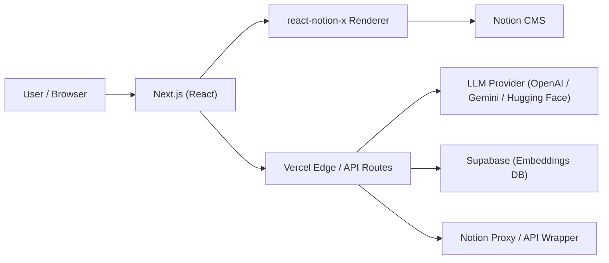
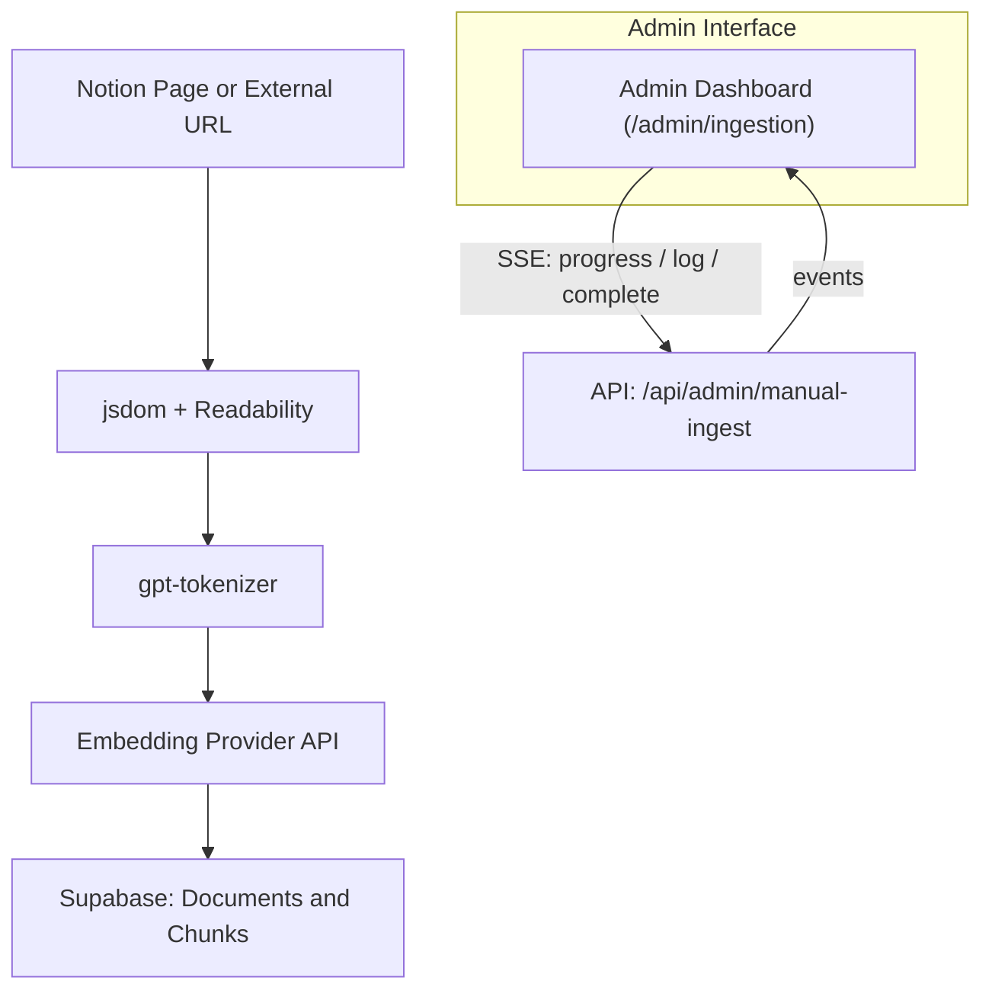

# Next.js + Notion Portfolio Framework


> A customized evolution of the [Next.js Notion Starter Kit](https://github.com/transitive-bullshit/nextjs-notion-starter-kit), rebuilt for an **AI-integrated personal portfolio website** featuring Notion CMS, RAG ingestion, and an Edge-based Chat Assistant.

---

## 🚀 Features

### 🧱 Hybrid SSG + Serverless

- Built with **Next.js + React**, deployed on **Vercel Edge Runtime**
- Supports **Incremental Static Regeneration (ISR)** for fast yet dynamic content
- Dynamic Notion rendering powered by **react-notion-x**

### 🧩 RAG + Admin Ingestion + Chat Assistant

- End-to-end document ingestion pipeline (manual + batch modes)
- Semantic embeddings via configurable providers (**OpenAI**, **Gemini**, **Hugging Face**) stored in **Supabase**
- `/admin/ingestion` dashboard with real-time progress (SSE streaming)
- Built-in **Chat Assistant** with a floating panel UI and streaming responses

### 🎨 Enhanced UI/UX

- Custom **Notion CSS overrides** for better readability and layout control
- Integrated **Mermaid diagram** rendering
- **SidePeek** panel animations for smoother navigation
- SEO-optimized meta tags and Open Graph previews

---

## ⚙️ Setup

1. **Clone and install**

   ```bash
   git clone https://github.com/jack-h-park/nextjs-react-notion-x
   cd nextjs-react-notion-x
   pnpm install
   ```

2. **Configure environment variables**
   Create a `.env.local` file:

   ```bash
   ADMIN_DASH_USER=admin
   ADMIN_DASH_PASS=secret
   NOTION_PAGE_CACHE_TTL=300

   LLM_PROVIDER=openai
   # EMBEDDING_PROVIDER=
   # GOOGLE_API_KEY=...
   # HUGGINGFACE_API_KEY=...
   OPENAI_API_KEY=sk-...
   SUPABASE_URL=https://your-project.supabase.co
    SUPABASE_ANON_KEY=...
   SUPABASE_SERVICE_ROLE_KEY=...
  ```

### 🔧 Advanced LLM/RAG tuning

The assistant ships with sensible defaults, but you can fine‑tune behaviour via the following knobs:

| Variable | Default | Description |
| --- | --- | --- |
| `LLM_MODEL` | `gpt-4o-mini` | Primary chat-completion model ID for the active provider (OpenAI, Gemini, Hugging Face). |
| `EMBEDDING_MODEL` | `text-embedding-3-small` | Embedding model used for ingestion and live queries; must match the vectors stored in Supabase. |
| `RAG_TOP_K` | `15` | How many chunks to fetch per query before context compression. Raise this when your corpus is small and you want broader coverage. |
| `LLM_TEMPERATURE` | `0.0` | Sampling temperature for answers. Keep near zero for factual Q&A, raise for more creative tone. |
| `RAG_SIMILARITY_THRESHOLD` | `0.78` | Minimum cosine similarity required before a chunk can be included in the context window. |
| `CHAT_CONTEXT_TOKEN_BUDGET` | `1200` | Total token budget earmarked for retrieved excerpts per response. |
| `CHAT_CONTEXT_CLIP_TOKENS` | `320` | Maximum size of any single excerpt (extra tokens are trimmed). |
| `CHAT_HISTORY_TOKEN_BUDGET` | `900` | Conversation history token limit before the guardrails collapse older turns into a summary. |
| `CHAT_SUMMARY_ENABLED` | `true` | Enables the rolling summary feature once the history budget is exceeded. |
| `CHAT_SUMMARY_TRIGGER_TOKENS` | `400` | When a single conversation surpasses this many tokens, the summary pass is triggered. |
| `CHAT_SUMMARY_MAX_TURNS` | `6` | Maximum turns (pairs of user/assistant messages) considered when generating a summary. |
| `CHAT_SUMMARY_MAX_CHARS` | `600` | Hard character cap for the generated summary so it fits inside the prompt. |
| `CHAT_CHITCHAT_KEYWORDS` | `"hello,hi,how are you,whats up,what is up,tell me a joke"` | Comma-separated phrases treated as lightweight chitchat and answered without hitting Supabase. |
| `CHAT_FALLBACK_CHITCHAT_CONTEXT` | _(string)_ | Prompt snippet injected whenever a chitchat intent is detected; useful for defining tone. |
| `CHAT_FALLBACK_COMMAND_CONTEXT` | _(string)_ | Prompt snippet used when the user appears to request an action/command the assistant cannot execute. |

> Tip: keep embeddings and RAG settings aligned—if you re-ingest with a different `EMBEDDING_MODEL`, update `.env.local` before running the ingestion scripts so live queries use the same vectors.

3. **Prepare Supabase chat settings table**

   ```sql
   create table if not exists chat_settings (
     key text primary key,
     value text not null,
     updated_at timestamptz not null default timezone('utc', now())
   );
   ```

   > The admin dashboard (`/admin/chat-config`) reads and updates the shared system prompt from this table.

4. **Run locally**

   ```bash
   pnpm dev
   ```

5. **Deploy to Vercel**
   ```bash
   pnpm run deploy
   ```

---

## 🧭 Architecture

### 🌐 Web Request Flow



### ⚙️ Ingestion & RAG Pipeline



> **Supabase 레이어**는 공급자별 테이블/뷰(`rag_chunks_openai`, `rag_chunks_gemini`, `rag_chunks_hf`, `lc_chunks_*`)을 사용합니다. 인제스트 시 선택한 임베딩 공급자와 동일한 테이블/함수를 호출해 주세요.

---

## 🧩 Dependencies

- **OpenAI SDK**, **@google/generative-ai**, **@huggingface/inference**, **Supabase JS**, **gpt-tokenizer**
- **@langchain/openai**, **@langchain/google-genai**, **@langchain/community**
- **@mozilla/readability**, **jsdom**, **exponential-backoff**
- **framer-motion**, **react-modal**, **@react-icons/all-files**

---

## 🧠 Credits

- **Base Project:** [Next.js Notion Starter Kit](https://github.com/transitive-bullshit/nextjs-notion-starter-kit)
- **Author:** Jack H. Park
- **Hosting:** [Vercel](https://vercel.com)
- **CMS:** [Notion](https://www.notion.so)

---

> _v0.1.0 — Initial Structured Release_  
> The first structured, feature-complete iteration with RAG ingestion, chat assistant, and admin UI.
